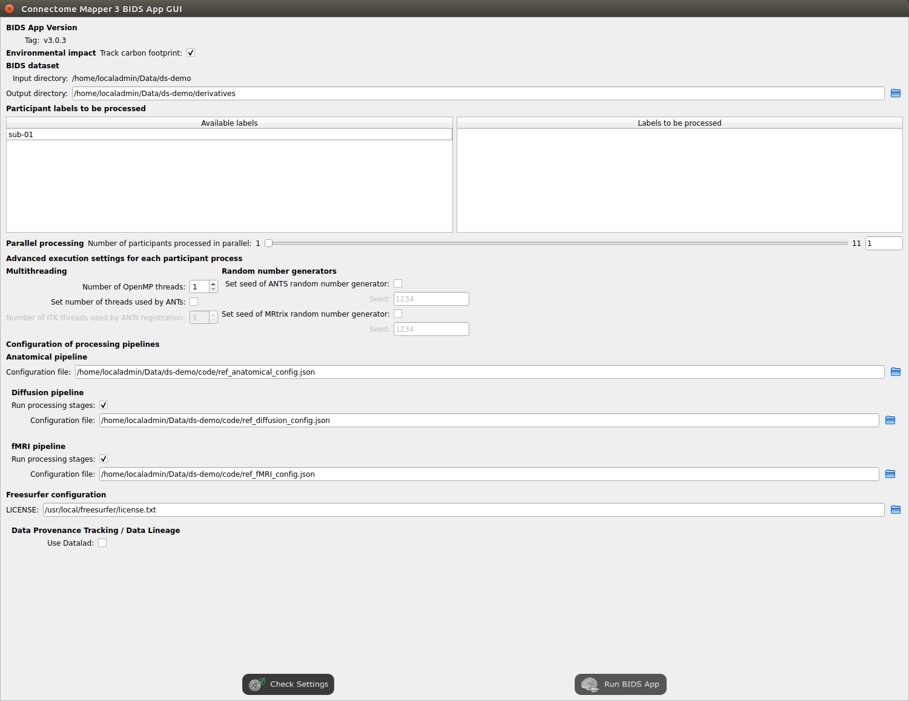

===================================================
Graphical User Interface
===================================================

Introduction
**************

TBC

.. figure:: images/mainWindow.png
	:align: center

	Main window of the Connectome Mapper BIDS App Manager

Start the Graphical User Interface
***************************************

In a terminal, enter to following::

    $ source activate py27cmp-gui

or::

    $ conda activate py27cmp-gui

Please see Section :ref:`manual-install-cmpbidsappmanager` for more details about installation.

After activation of the conda environment, start the graphical user interface called ``Connectome Mapper 3`` BIDS App Manager ::

    $ cmpbidsappmanager

Load a BIDS dataset
***********************

The ``Connectome Mapper 3`` BIDS App Manager allows you to:

* load a BIDS dataset stored locally

You only have to select the root directory of your valid BIDS dataset (see note below)

* create a new datalad/BIDS dataset locally from an existing local or remote datalad/BIDS dataset (This is a feature under development)

Select the mode "Install a Datalad/BIDS dataset".

If ssh connection is used, make sure to enable the  "install via ssh" and to provide all connection details (IP address / Remote host name, remote user, remote password)

.. note:: The input dataset MUST be a valid :abbr:`BIDS (Brain Imaging Data Structure)` structured dataset and must include at least one T1w or MPRAGE structural image. We highly recommend that you validate your dataset with the free, online `BIDS Validator <http://bids-standard.github.io/bids-validator/>`_.

Pipeline stage configuration
*****************************

Start the Configurator Window
--------------------------------

* From the main window, click on the left button to start the Configurator Window.

.. image:: images/mainWindow_configurator.png
	:align: center

* The window of the Connectome Mapper BIDS App Configurator will appear, which will assist you note only in configuring the pipeline stages (each pipeline has a tab panel), but also in creating appropriate configuration files which could be used outside the Graphical User Interface.

.. figure:: images/configurator_window.png
	:align: center

	Configurator Window of the Connectome Mapper

The outputs depend on the chosen parameters.

Anatomical pipeline stages
---------------------------
	

Segmentation
""""""""""""""

Performs tissue segmentation using Freesurfer or custom segmentation.  

*Freesurfer*

 	.. image:: images/segmentation_fs.png
		:align: center

	* *Freesurfer args:* used to specify Freesurfer processing options
	* *Use existing freesurfer data:* Check this box if you have already Freesurfer output data available
	
*Custom segmentation*

	.. warning:: Not fully tested. Development and testing in progress.

 	.. image:: images/segmentation_custom.png
		:align: center

	* *White matter mask:* select the file containing your white matter binary mask

Parcellation
""""""""""""""

Generates the Native Freesurfer or Lausanne2008/Lausanne2018 parcellation from Freesurfer data, or takes a custom parcellation atlas.
	
**Parcellation scheme**

	* *NativeFreesurfer:* 

		.. image:: images/parcellation_fs.png
			:align: center

		Atlas composed of 83 regions from the Freesurfer aparc+aseg file

	* *Lausanne2008:*
	
		.. image:: images/parcellation_lausanne2008.png
			:align: center
		
		Multi-resolution atlas

	* *Lausanne2018:*

		.. image:: images/parcellation_lausanne2018.png
			:align: center
		
		Lausanne 2008 atlas extended with 7 thalamic nuclei, 12 hippocampal subfields, and 4 brainstem sub-structure per hemisphere
	
	* *Custom:* 

		.. warning:: Not fully tested. Development and testing in progress.

		.. image:: images/parcellation_custom.png
			:align: center
		
		Custom atlas. Specify the atlas name, the number of regions, the nifti file and a corresponding graphml file. The Graphml file must contain at least a "dn_correspondence_id" field for each node. This field should contain the region's label in the nifti file.

Diffusion pipeline stages
---------------------------

Preprocessing
""""""""""""""

Preprocessing includes denoising, bias field correction, motion and eddy current correction for diffusion data.

*Denoising*

	Remove noise from diffusion images using (1) MRtrix3 MP-PCA method or (2) Dipy Non-Local Mean (NLM) denoising with Gaussian or Rician noise models

*Bias field correction*

	Remove intensity inhomogeneities due to the magnetic resonnace bias field using (1) MRtrix3 N4 bias field correction or (2) the bias field correction provided by FSL FAST.

*Motion correction*

	Aligns diffusion volumes to the b0 volume using FSL's MCFLIRT.
	
	.. note:: For hemi-sphere DSI aquisitions, warning outputs will be displayed in the console when processing empty volumes.

*Eddy current correction*

	Corrects for eddy current distortions using FSL's Eddy correct tool.

*Resampling*

	Resample morphological and diffusion data to F0 x F1 x F2 mm^3
	
Registration
""""""""""""""

**Registration mode**

	* FSL (Linear):

		.. image:: images/registration_flirt.png
			:align: center

	 	Perform linear registration from T1 to diffusion b0 using FSL's flirt.
	
	* BBregister (FS):

		.. image:: images/registration_fs.png
			:align: center
	
		Perform linear registration using Freesurfer BBregister tool.
	
	* Non-linear (ANTS):

		.. image:: images/registration_ants.png
			:align: center
		
	 	Perform symmetric diffeomorphic SyN registration from T1 to b0 

Diffusion reconstruction and tractography
""""""""""""""""""""""""""""""""""""""""""""

Perform diffusion reconstruction and local deterministic or probabilistic tractography based on several tools. ROI dilation is required to map brain connections when the tracking only operates in the white matter.

	.. figure:: images/diffusion_config_window.png
		:align: center
		
		Diffusion stage configuration window

**Reconstruction tool**

		
	**Dipy**: perform SHORE, tensor, CSD and MAP-MRI reconstruction.

		* SHORE:
		
			.. image:: images/diffusion_dipy_shore.png
				:align: center
				
			SHORE performed only on DSI data

		* Tensor:
		
			.. image:: images/diffusion_dipy_tensor.png
				:align: center
				
			Tensor performed only on DTI data

		* CSD:
		
			.. image:: images/diffusion_dipy_csd.png
				:align: center
				
			CSD performed on DTI and multi-shell data

		* MAP_MRI:
		
			.. image:: images/diffusion_dipy_mapmri.png
				:align: center
				
			MAP-MRI performed only on multi-shell data

	**MRtrix**: perform CSD reconstruction.

		* CSD:
		
			.. image:: images/diffusion_mrtrix_csd.png
				:align: center
				
			CSD performed on DTI and multi-shell data
	

**Tractography tool**

	**Dipy**: perform deterministic and probabilistic fiber tracking as well as particle filtering tractography. 
		
		* Deterministic tractography:
		
			.. image:: images/diffusion_dipy_deterministic.png
				:align: center
				
			Deterministic tractography (SD_STREAM) performed on single tensor or CSD reconstruction

		* Probabilistic tractography:
		
			.. image:: images/diffusion_dipy_probabilistic.png
				:align: center
				
			Probabilistic tractography (iFOD2) performed on SHORE or CSD reconstruction

		* Probabilistic particle filtering tractography (PFT):
		
			.. image:: images/diffusion_dipy_probabilistic_PFT.png
				:align: center
				
			Probabilistic PFT tracking performed on SHORE or CSD reconstruction. Seeding from the gray matter / white matter interface is possible.

		.. note:: We noticed a shift of the center of tractograms obtained by dipy. As a result, tractograms visualized in TrackVis are not commonly centered despite the fact that the tractogram and the ROIs are properly aligned.

		
	**MRtrix**: perform deterministic and probabilistic fiber tracking as well as anatomically-constrained tractography. ROI dilation is required to map brain connections when the tracking only operates in the white matter.
		
		* Deterministic tractography:
		
			.. image:: images/diffusion_mrtrix_deterministic.png
				:align: center
				
			Deterministic tractography (SD_STREAM) performed on single tensor or CSD reconstruction

		* Deterministic anatomically-constrained tractography (ACT):
		
			.. image:: images/diffusion_mrtrix_deterministic_ACT.png
				:align: center
				
			Deterministic ACT tracking performed on single tensor or CSD reconstruction. Seeding from the gray matter / white matter interface is possible. Backtrack option is not available in deterministic tracking.

		* Probabilistic tractography:
		
			.. image:: images/diffusion_mrtrix_probabilistic.png
				:align: center
				
			Probabilistic tractography (iFOD2) performed on SHORE or CSD reconstruction

		* Probabilistic anatomically-constrained tractography (ACT):
		
			.. image:: images/diffusion_mrtrix_probabilistic_ACT.png
				:align: center
				
			Probabilistic ACT tracking performed on SHORE or CSD reconstruction. Seeding from the gray matter / white matter interface is possible.
			
	
Connectome
""""""""""""""

Compute fiber length connectivity matrices. If DTI data is processed, FA additional map is computed. In case of DSI, additional maps include GFA and RTOP. In case of MAP-MRI, additional maps are RTPP, RTOP, ...

.. image:: images/connectome.png
	:align: center

*Output types*

	Select in which formats the connectivity matrices should be saved.

FMRI pipeline stages
---------------------

Preprocessing
""""""""""""""

Preprocessing refers to processing steps prior to registration. It includes discarding volumes, despiking, slice timing correction and motion correction for fMRI (BOLD) data.

.. image:: images/preprocessing_fmri.png
	:align: center

*Discard n volummes*

	Discard n volumes from further analysis

*Despiking*

	Perform despiking of the BOLD signal using AFNI.

*Slice timing and Repetition time*

	Perform slice timing correction using FSL's slicetimer.

*Motion correction*

	Align BOLD volumes to the mean BOLD volume using FSL's MCFLIRT.

Registration
""""""""""""""

**Registration mode**

	* FSL (Linear):

		.. image:: images/registration_flirt_fmri.png
			:align: center

		Perform linear registration from T1 to mean BOLD using FSL's flirt.
	
	* BBregister (FS)

		.. image:: images/registration_fs_fmri.png
			:align: center
	
		Perform linear registration using Freesurfer BBregister tool from T1 to mean BOLD via T2.

		.. warning:: development in progress

fMRI processing
"""""""""""""""""""

Performs detrending, nuisance regression, bandpass filteringdiffusion reconstruction and local deterministic or probabilistic tractography based on several tools. ROI dilation is required to map brain connections when the tracking only operates in the white matter.

*Detrending*

	.. image:: images/detrending.png
		:align: center

	Detrending of BOLD signal using:
	1. *linear* trend removal algorithm provided by the `scipy` library
	2. *quadratic* trend removal algorithm provided by the `obspy` library

*Nuisance regression*

	.. image:: images/nuisance.png
		:align: center

	A number of options for removing nuisance signals is provided. They consist of:
	1. *Global signal* regression 
	2. *CSF* regression
	3. *WM* regression
	4. *Motion parameters* regression

*Bandpass filtering*

	.. image:: images/bandpass.png
		:align: center

	Perform bandpass filtering of the time-series using FSL's slicetimer 

Connectome
""""""""""""""

Computes ROI-averaged time-series and the correlation connectivity matrices.

.. image:: images/connectome_fmri.png
	:align: center

*Output types*

	Select in which formats the connectivity matrices should be saved.
	
Save the configuration files
-------------------------------

You can save the pipeline stage configuration files in two different way:

	1. You can save all configuration files at once by clicking on the `Save All Pipeline Configuration Files`. This  will save automatically the configuration file of the anatomical / diffusion / fMRI pipeline to `<bids_dataset>/code/ref_anatomical_config.ini` / `<bids_dataset>/code/ref_diffusion_config.ini` / `<bids_dataset>/code/ref_fMRI_config.ini` respectively.

	2. You can save individually each of the pipeline configuration files and edit its filename in the File menu (File -> Save anatomical/diffusion/fMRI configuration file as...)
 
Nipype 
-------

The Connectome Mapper processing relies on nipype. For each stage, a processing folder is created in $Base_directory/derivatives/nipype/sub-<participant_label>/<pipeline_name>/<stage_name>.

All intermediate steps for the processing are saved in the corresponding stage folders.
	

Run the BIDS App
*********************

Start the Connectome Mapper BIDS App GUI
-----------------------------------------

* From the main window, click on the middle button to start the Connectome Mapper BIDS App GUI.

.. image:: images/mainWindow_bidsapp.png
	:align: center

* The window of the Connectome Mapper BIDS App GUI will appear, which will help you in setting up and launching the BIDS App run.

	Window of the Connectome Mapper BIDS App GUI

Run configuration
-------------------

* Select the subject labels to be processed

	.. image:: images/bidsapp_select.png
		:align: center

* Check/Uncheck the pipelines to be performed

	.. image:: images/bidsapp_pipeline_check.png
		:align: center	

* Specify your Freesurfer license

	.. image:: images/bidsapp_fslicense.png
		:align: center

	.. note:: Your freesurfer license will be copied to your dataset directory as `<bids_dataset>/code/license.txt` which will be mounted inside the BIDS App container image.

* When the run is set up, you can click on the `Check settings` button. 

	.. image:: images/bidsapp_checksettings.png
		:align: center

* If the setup is complete and valid, this will enable the `Run BIDS App` button.

	.. image:: images/bidsapp_checksettings2.png
		:align: center

You are ready to launch the BIDS App run!

Launch the BIDS App run
-------------------------

* Click on the `Run BIDS App` button to launch the BIDS App run

	.. image:: images/bidsapp_run.png
		:align: center

* You can see the complete `docker run` command generated by the Connectome Mapper BIDS App GUI from the terminal output such as in this example
	.. code-block:: console

		Start BIDS App
		> Copy FreeSurfer license (BIDS App Manager) 
		... src : /usr/local/freesurfer/license.txt
		... dst : /media/localadmin/HagmannHDD/Seb/ds-testLausanne2008SHOREPFT/code/license.txt
		> Datalad available: True
		*... Docker cmd 2 : ['docker', 'run', '-it', '--rm', '-v', '/media/localadmin/HagmannHDD/Seb/ds-testLausanne2008SHOREPFT:/tmp', '-u', '1000:1000', 'sebastientourbier/connectomemapper-bidsapp:3.0.0-beta-singularity', '/tmp', '/tmp/derivatives', 'participant', '--participant_label', 'A001', '--anat_pipeline_config', '/tmp/code/ref_anatomical_config.ini', '--dwi_pipeline_config', '/tmp/code/ref_diffusion_config.ini']*
		> BIDS dataset: /tmp
		> Subjects to analyze : ['A001']
		> Copy FreeSurfer license (BIDS App) 
		> Sessions to analyze : ['ses-20150203160809']
		> Process subject sub-A001 session ses-20150203160809
		WARNING: rewriting config file /tmp/derivatives/sub-A001_ses-20150203160809_anatomical_config.ini
		... Anatomical config created : /tmp/derivatives/sub-A001_ses-20150203160809_anatomical_config.ini
		WARNING: rewriting config file /tmp/derivatives/sub-A001_ses-20150203160809_diffusion_config.ini
		... Diffusion config created : /tmp/derivatives/sub-A001_ses-20150203160809_diffusion_config.ini
		... Running pipelines : 
		        - Anatomical MRI (segmentation and parcellation)
		        - Diffusion MRI (structural connectivity matrices)
		... cmd : connectomemapper3 /tmp /tmp/derivatives sub-A001 ses-20150203160809 /tmp/derivatives/sub-A001_ses-20150203160809_anatomical_config.ini True /tmp/derivatives/sub-A001_ses-20150203160809_diffusion_config.ini True

	.. note:: Also, this can be helpful in you wish to design your own batch scripts to call the BIDS App with the correct syntax.

Check progress
------------------

For each subject, the execution output of the pipelines are redirected to a log file, written as ``<bids_dataset/derivatives>/cmp/sub-<subject_label>_log.txt``. Execution progress can be checked by the means of these log files. 

Check stages outputs
****************************

TBC
