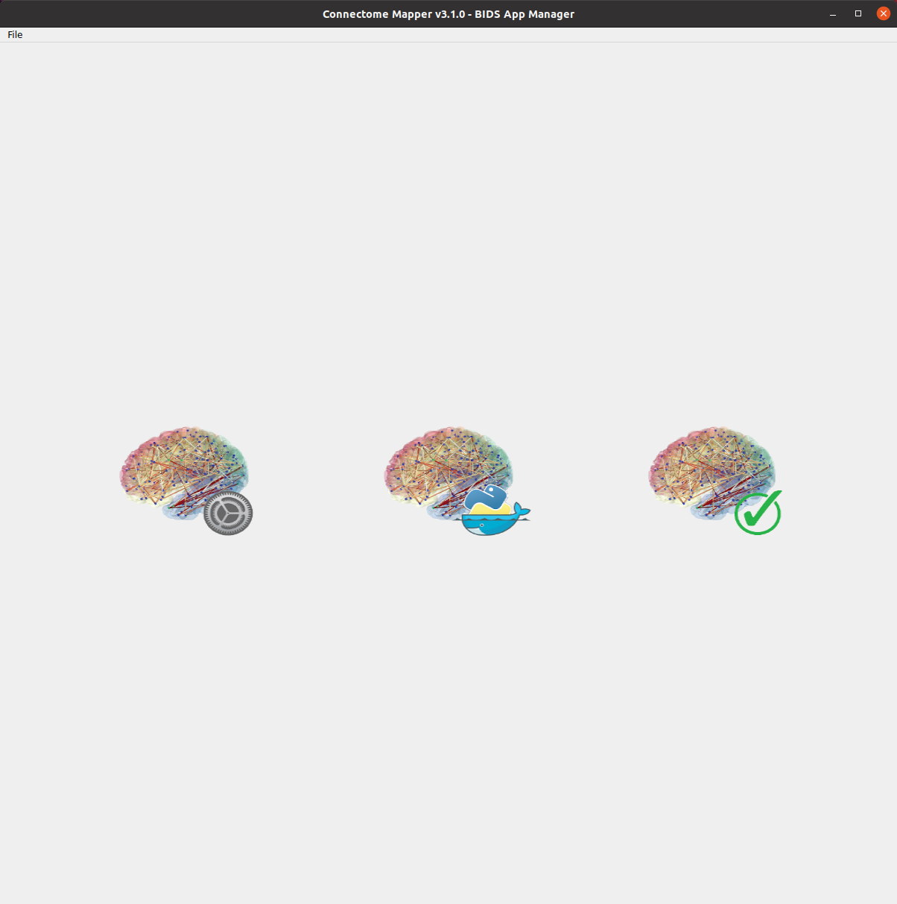
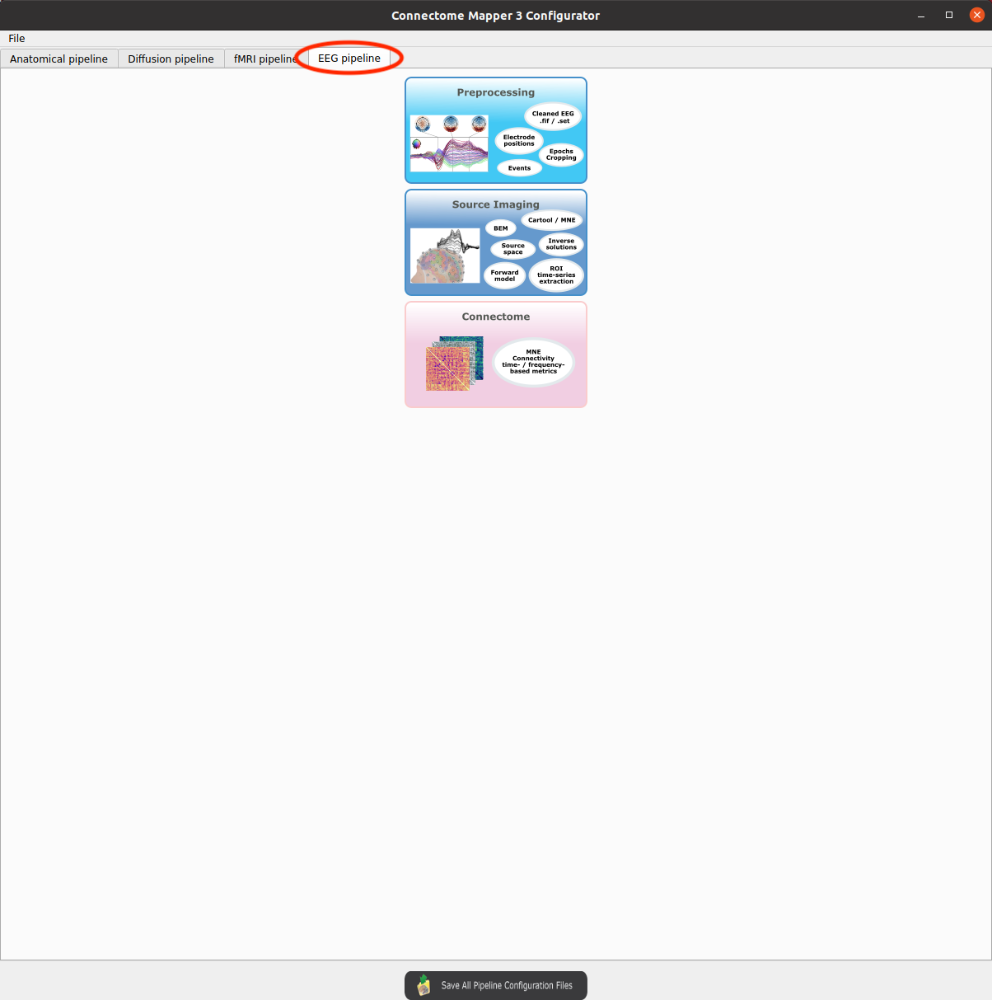
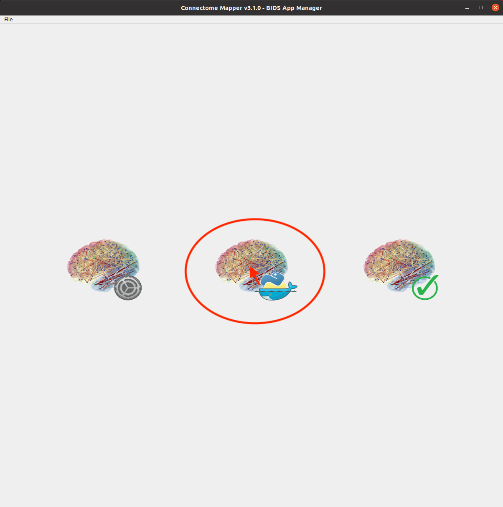
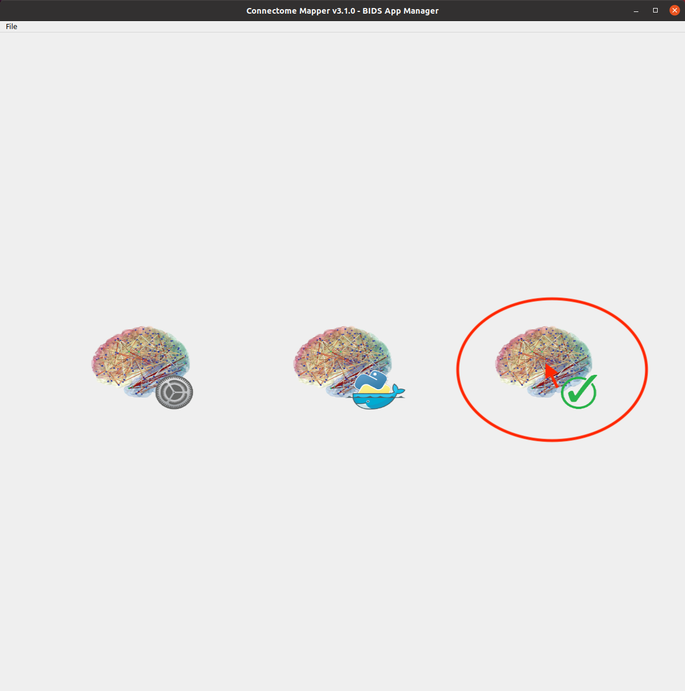
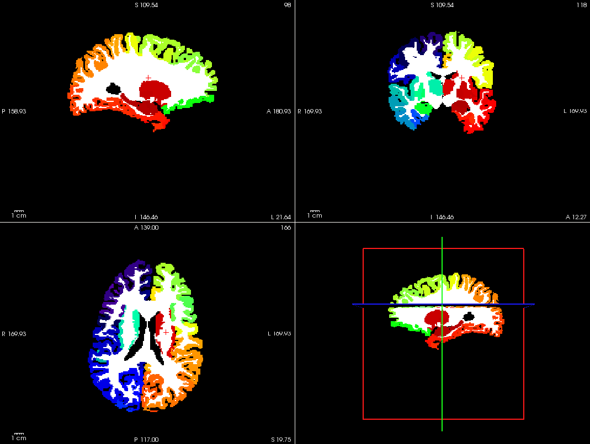
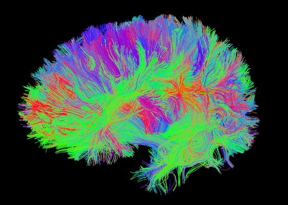
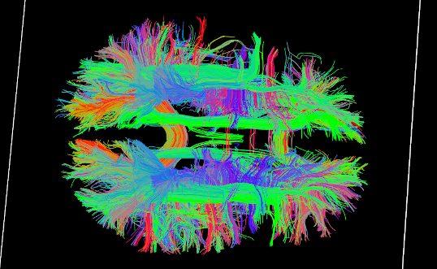

.. _guiusage:

===================================================
Graphical User Interface
===================================================

Introduction
**************

Connectome Mapper 3 comes with a Graphical User Interface, the Connectome Mapper BIDS App manager, designed to facilitate the configuration of all pipeline stages, the configuration of the BIDS App run and its execution, and the inspection of the different stage outputs with appropriate viewers.

    Main window of the Connectome Mapper BIDS App Manager

Start the Graphical User Interface
***************************************

In a terminal, enter to following::

    $ source activate py39cmp-gui

or::

    $ conda activate py39cmp-gui

Please see Section :ref:`manual-install-cmpbidsappmanager` for more details about installation.

After activation of the conda environment, start the graphical user interface called ``Connectome Mapper 3`` BIDS App Manager ::

    $ cmpbidsappmanager

.. note:: The main window would be blank until you select the BIDS dataset.

Load a BIDS dataset
***********************

*   Click on `File -> Load BIDS dataset...` in the menu bar of the main window. Note that on Mac, Qt turns this menu bar into the native menu bar (top of the screen).

    The ``Connectome Mapper 3`` BIDS App Manager gives you two different options:

    *   `Load BIDS dataset`: load a BIDS dataset stored locally.
        You only have to select the root directory of your valid BIDS dataset (see note below)

    *   `Install Datalad BIDS dataset`: create a new datalad/BIDS dataset locally from an existing local or remote datalad/BIDS dataset (This is a feature under development)
        If ssh connection is used, make sure to enable the  "install via ssh" and to provide all connection details (IP address / Remote host name, remote user, remote password)

.. note:: The input dataset MUST be a valid :abbr:`BIDS (Brain Imaging Data Structure)` structured dataset and must include at least one T1w or MPRAGE structural image. We highly recommend that you validate your dataset with the free, online `BIDS Validator <http://bids-standard.github.io/bids-validator/>`_.

Pipeline stage configuration
*****************************

Start the Configurator Window
--------------------------------

* From the main window, click on the left button to start the Configurator Window.

.. image:: images/mainWindow_configurator.png
    :align: center

* The window of the Connectome Mapper BIDS App Configurator will appear, which will assist you note only in configuring the pipeline stages (each pipeline has a tab panel), but also in creating appropriate configuration files which could be used outside the Graphical User Interface.

.. figure:: images/configurator_window.png
    :align: center

    Configurator Window of the Connectome Mapper

The outputs depend on the chosen parameters.

Anatomical pipeline stages
---------------------------

.. figure:: images/configurator_pipeline_anat.png
    :align: center

    Panel for configuration of anatomical pipeline stages

Segmentation
""""""""""""""

Prior to Lausanne parcellation, CMP3 relies on **Freesurfer** for the segmentation of the different brain tissues and the reconstruction of the cortical surfaces.
If you plan to use a custom parcellation, you will be required here to specify the pattern of the different existing segmentation files
that follows BIDS derivatives (See *Custom segmentation*).

.. _freesurfer_opt:

*Freesurfer*

    .. image:: images/segmentation_fs.png
        :align: center

    * *Number of threads:* used to specify how many threads are used for parallelization
    * *Brain extraction tools:* alternative brain extraction methods injected in Freesurfer
    * *Freesurfer args:* used to specify extra Freesurfer processing options

    .. note::
        If you have already Freesurfer v5 / v6 / v7 output data available, CMP3 can use them if there are placed in your output / derivatives directory.
        Note however that since ``v3.0.3``, CMP3 expects to find a ``freesurfer-7.1.1``, so make sure that your derivatives are organized as
        follows::

            your_bids_dataset
              derivatives/
                freesurfer-7.1.1/
                  sub-01[_ses-01]/
                    label/
                    mri/
                    surf/
                    ...
                  ...
              sub-01/
              ...

*Custom segmentation*

    .. image:: images/custom_segmentation.png
        :align: center

    You can use any parcellation scheme of your choice as long as you provide a list of segmentation files organized following the `BIDS derivatives specifications <https://bids-specification.readthedocs.io/en/stable/05-derivatives/03-imaging.html#segmentations>`_ for segmentation files, provide appropriate ``.tsv`` sidecar files that describes the index/label/color mapping of the parcellation, and adopt the ``atlas-<label>`` entity to encode the name of the atlas, i.e::

        <derivatives_directory>/
          sub-<participant_label>/
            anat/
              <source_entities>_desc-brain_mask.nii.gz
              <source_entities>_label-GM[_desc-<label>]_dseg.nii.gz
              <source_entities>_label-WM[_desc-<label>]_dseg.nii.gz
              <source_entities>_label-CSF[_desc-<label>]_dseg.nii.gz
              <source_entities>_desc-aparcaseg_dseg.nii.gz

    The ``desc`` BIDS entity can be used to target specific mask and segmentation files.

    For instance, the configuration above would allows us to re-use the outputs of the anatomical pipeline obtained with the previous ``v3.0.2`` version of CMP3::

            your_bids_dataset
              derivatives/
                cmp-v3.0.2/
                  sub-01/
                    anat/
                      sub-01_desc-brain_mask.nii.gz
                      sub-01_label-GM_dseg.nii.gz
                      sub-01_label-WM_dseg.nii.gz
                      sub-01_label-CSF_dseg.nii.gz
                      sub-01_desc-aparcaseg_dseg.nii.gz
                      ...
                  ...
              sub-01/
              ...

    .. important::
        If you plan to use either Anatomically Constrained or Particle Filtering tractography, you will still require to have Freesurfer 7 output data available in your output / derivatives directory, as described the above note in `*Freesurfer* <freesurfer_opt>`_.

Parcellation
""""""""""""""

Generates the Native Freesurfer or Lausanne2018 parcellation from Freesurfer data. Alternatively, since ``v3.0.3`` you can use your own custom parcellation files.

**Parcellation scheme**

    * *NativeFreesurfer:*

        .. image:: images/parcellation_fs.png
            :align: center

        Atlas composed of 83 regions from the Freesurfer aparc+aseg file

    * *Lausanne2018:*

        .. image:: images/parcellation_lausanne2018.png
            :align: center

        New version of Lausanne parcellation atlas, corrected, and extended with 7 thalamic nuclei, 12 hippocampal subfields, and 4 brainstem sub-structure per hemisphere

        .. admonition:: Since v3.0.0, Lausanne2018 parcellation has completely replaced the old Lausanne2008 parcellation.

            As it provides improvements in the way Lausanne parcellation label are generated,
            any code and data related to Lausanne2008 has been removed. If you still wish to
            use this old parcellation scheme, please use `v3.0.0-RC4` which is the last version
            that supports it.

    * *Custom:*

        .. image:: images/custom_parcellation.png
            :align: center

        You can use any parcellation scheme of your choice as long as they follow the `BIDS derivatives specifications <https://bids-specification.readthedocs.io/en/stable/05-derivatives/03-imaging.html#segmentations>`_ for segmentation files, provide appropriate ``.tsv`` sidecar files that describes the index/label/color mapping of the parcellation, and adopt the ``atlas-<label>`` entity to encode the name of the atlas, i.e::

            <derivatives_directory>/
              sub-<participant_label>/
                anat/
                  <source_entities>[_space-<space>]_atlas-<label>[_res-<label>]_dseg.nii.gz
                  <source_entities>[_space-<space>]_atlas-<label>[_res-<label>]_dseg.tsv

        The ``res`` BIDS entity allows the differentiation between multiple scales of the same atlas.

        For instance, the above configuration would allows us to re-use the scale 1 of the Lausanne parcellation generated by the anatomical pipeline obtained of the previous ``v3.0.2`` version of CMP3::

            your_bids_dataset
              derivatives/
                cmp-v3.0.2/
                  sub-01/
                    anat/
                      sub-01_atlas-L2018_res-scale1_dseg.nii.gz
                      sub-01_atlas-L2018_res-scale1_dseg.tsv
                      ...
                  ...
              sub-01/
              ...

Diffusion pipeline stages
---------------------------

    Panel for configuration of diffusion pipeline stages

Preprocessing
""""""""""""""

Preprocessing includes denoising, bias field correction, motion and eddy current correction for diffusion data.

.. image:: images/preprocessing.png
    :align: center

*Denoising*

    Remove noise from diffusion images using (1) MRtrix3 MP-PCA method or (2) Dipy Non-Local Mean (NLM) denoising with Gaussian or Rician noise models

*Bias field correction*

    Remove intensity inhomogeneities due to the magnetic resonance bias field using (1) MRtrix3 N4 bias field correction or (2) the bias field correction provided by FSL FAST

*Motion correction*

    Aligns diffusion volumes to the b0 volume using FSL's MCFLIRT

*Eddy current correction*

    Corrects for eddy current distortions using FSL's Eddy correct tool

*Resampling*

    Resample morphological and diffusion data to F0 x F1 x F2 mm^3

Registration
""""""""""""""

**Registration mode**

    * FSL (Linear):

        .. image:: images/registration_flirt.png
            :align: center

        Perform linear registration from T1 to diffusion b0 using FSL's flirt

    * Non-linear (ANTS):

        .. image:: images/registration_ants.png
            :align: center

        Perform symmetric diffeomorphic SyN registration from T1 to diffusion b=0

Diffusion reconstruction and tractography
""""""""""""""""""""""""""""""""""""""""""""

Perform diffusion reconstruction and local deterministic or probabilistic tractography based on several tools. ROI dilation is required to map brain connections when the tracking only operates in the white matter.

    .. figure:: images/diffusion_config_window.png
        :align: center

        Diffusion stage configuration window

**Reconstruction tool**

    **Dipy**: perform SHORE, tensor, CSD and MAP-MRI reconstruction

        * SHORE:

            .. image:: images/diffusion_dipy_shore.png
                :align: center

            SHORE performed only on DSI data

        * Tensor:

            .. image:: images/diffusion_dipy_tensor.png
                :align: center

            Tensor performed only on DTI data

        * CSD:

            .. image:: images/diffusion_dipy_csd.png
                :align: center

            CSD performed on DTI and multi-shell data

        * MAP_MRI:

            .. image:: images/diffusion_dipy_mapmri.png
                :align: center

            MAP-MRI performed only on multi-shell data

    **MRtrix**: perform CSD reconstruction.

        * CSD:

            .. image:: images/diffusion_mrtrix_csd.png
                :align: center

            CSD performed on DTI and multi-shell data

**Tractography tool**

    **Dipy**: perform deterministic and probabilistic fiber tracking as well as particle filtering tractography.

        * Deterministic tractography:

            .. image:: images/diffusion_dipy_deterministic.png
                :align: center

            Deterministic tractography (SD_STREAM) performed on single tensor or CSD reconstruction

        * Probabilistic tractography:

            .. image:: images/diffusion_dipy_probabilistic.png
                :align: center

            Probabilistic tractography (iFOD2) performed on SHORE or CSD reconstruction

        * Probabilistic particle filtering tractography (PFT):

            .. image:: images/diffusion_dipy_probabilistic_PFT.png
                :align: center

            Probabilistic PFT tracking performed on SHORE or CSD reconstruction. Seeding from the gray matter / white matter interface is possible.

        .. note:: We noticed a shift of the center of tractograms obtained by dipy. As a result, tractograms visualized in TrackVis are not commonly centered despite the fact that the tractogram and the ROIs are properly aligned.

    **MRtrix**: perform deterministic and probabilistic fiber tracking as well as anatomically-constrained tractography. ROI dilation is required to map brain connections when the tracking only operates in the white matter.

        * Deterministic tractography:

            .. image:: images/diffusion_mrtrix_deterministic.png
                :align: center

            Deterministic tractography (SD_STREAM) performed on single tensor or CSD reconstruction

        * Deterministic anatomically-constrained tractography (ACT):

            .. image:: images/diffusion_mrtrix_deterministic_ACT.png
                :align: center

            Deterministic ACT tracking performed on single tensor or CSD reconstruction. Seeding from the gray matter / white matter interface is possible. Backtrack option is not available in deterministic tracking.

        * Probabilistic tractography:

            .. image:: images/diffusion_mrtrix_probabilistic.png
                :align: center

            Probabilistic tractography (iFOD2) performed on SHORE or CSD reconstruction

        * Probabilistic anatomically-constrained tractography (ACT):

            .. image:: images/diffusion_mrtrix_probabilistic_ACT.png
                :align: center

            Probabilistic ACT tracking performed on SHORE or CSD reconstruction. Seeding from the gray matter / white matter interface is possible.

Connectome
""""""""""""""

Compute fiber length connectivity matrices. If DTI data is processed, FA additional map is computed. In case of DSI, additional maps include GFA and RTOP. In case of MAP-MRI, additional maps are RTPP, RTOP, ...

*Output types*

    Select in which formats the connectivity matrices should be saved.

FMRI pipeline stages
---------------------

    Panel for configuration of fMRI pipeline stages

Preprocessing
""""""""""""""

Preprocessing refers to processing steps prior to registration. It includes discarding volumes, despiking, slice timing correction and motion correction for fMRI (BOLD) data.

*Discard n volummes*

    Discard n volumes from further analysis

*Despiking*

    Perform despiking of the BOLD signal using AFNI.

*Slice timing and Repetition time*

    Perform slice timing correction using FSL's slicetimer.

*Motion correction*

    Align BOLD volumes to the mean BOLD volume using FSL's MCFLIRT.

Registration
""""""""""""""

**Registration mode**

    * FSL (Linear):

        .. image:: images/registration_flirt_fmri.png
            :align: center

        Perform linear registration from T1 to mean BOLD using FSL's flirt.

    * BBregister (FS)

        .. image:: images/registration_fs_fmri.png
            :align: center

        Perform linear registration using Freesurfer BBregister tool from T1 to mean BOLD via T2.

        .. warning:: development in progress

fMRI processing
"""""""""""""""""""

Performs detrending, nuisance regression, bandpass filteringdiffusion reconstruction and local deterministic or probabilistic tractography based on several tools. ROI dilation is required to map brain connections when the tracking only operates in the white matter.

*Detrending*

    .. image:: images/detrending.png
        :align: center

    Detrending of BOLD signal using:

        1. *linear* trend removal algorithm provided by the `scipy` library
        2. *quadratic* trend removal algorithm provided by the `obspy` library

*Nuisance regression*

    .. image:: images/nuisance.png
        :align: center

    A number of options for removing nuisance signals is provided. They consist of:

        1. *Global signal* regression
        2. *CSF* regression
        3. *WM* regression
        4. *Motion parameters* regression

*Bandpass filtering*

    .. image:: images/bandpass.png
        :align: center

    Perform bandpass filtering of the time-series using FSL's slicetimer

Connectome
""""""""""""""

Computes ROI-averaged time-series and the correlation connectivity matrices.

.. image:: images/connectome_fmri.png
    :align: center

*Output types*

    Select in which formats the connectivity matrices should be saved.

EEG pipeline stages
-------------------

    Panel for configuration of EEG pipeline stages

EEG Preprocessing
"""""""""""""""""

EEG Preprocessing refers to steps that loads, crop, and save preprocessed EEG epochs data of a given task in `fif` format, the harmonized format used further in the pipeline.

EEG data can be provided as:

1. A `mne.Epochs` object already saved in `.fif` format:

    .. image:: images/eeg_preproc_fif.png
        :align: center

2. A set of the following files and parameters:

    .. image:: images/eeg_preproc_set.png
        :align: center

    * *Preprocessed EEG recording*: store the Epochs * Electrodes dipole time-series in eeglab `.set` format

    * *Recording events file* in `BIDS *_events.tsv format`_: describe timing and other properties of events recorded during the task

    * *Electrodes file* file in `BIDS *_electrodes.tsv format`_ or in `Cartool *.xyz format`_: store the electrode coordinates

    * *Epochs time window*: relative start and end time to crop the epochs

.. _`BIDS *_events.tsv format`: https://bids-specification.readthedocs.io/en/stable/04-modality-specific-files/05-task-events.html#task-events

.. _ `BIDS *_electrodes.tsv format`: https://bids-specification.readthedocs.io/en/stable/04-modality-specific-files/03-electroencephalography.html#electrodes-description-_electrodestsv

.. _`Cartool *.xyz format`: https://sites.google.com/site/cartoolcommunity/user-s-guide/analysis/reading-visualizing-eeg-files

EEG Source Imaging
""""""""""""""""""

EEG Source Imaging refers to the all the steps necessary to obtain the inverse solutions and extract ROI time-series for a given parcellation scheme.

    *   *Structural parcellation*: specify the cmp derivatives directory, the parcellation scheme, and the scale (for Lausanne 2018) to retrieve the parcellation files

        .. image:: images/eeg_esi_parcellation.png
                :align: center

    *   *Tool*: CMP3 can either leverage MNE to compute the inverse solutions or take inverse solutions already pre-computed with Cartool as input.

        .. image:: images/eeg_esi_tool.png
                :align: center

        *   *MNE*

            If `MNE` is selected, all steps necessary to reconstruct the inverse solutions are performed by leveraging MNE. In this case, the following files and parameters need to be provided:

            .. image:: images/eeg_esi_mne.png
                :align: center

            * *MNE ESI method*: Method to compute the inverse solutions

            * *MNE ESI method SNR*: SNR level used to regularize the inverse solutions

            * *MNE electrode transform*: Additional transform in MNE `trans.fif` format  to be applied to electrode coordinates when *Apply electrode transform* is enabled

        *   *Cartool*

            If `Cartool` is selected, the following files (generated by this tool) and parameters need to be provided:

            .. image:: images/eeg_esi_cartool.png
                :align: center

            * *Source space file*: `*.spi` text file with 3D-coordinates (x, y and z-dimension) with possible solution points necessary to obtain the sources or generators of ERPs

            * *Inverse solution file*: `*.is` binary file that includes number of electrodes and solution points

            * *Cartool esi method*: Method used to compute the inverse solutions (*Cartool esi method*)

            * *Cartool esi lamb*: Regularization level of inverse solutions

            * *SVD for ROI time-courses extraction*: Start and end TOI parameters for the SVD algorithm that extract single ROI time-series from dipoles.

EEG Connectome
""""""""""""""

Computes frequency- and time-frequency-domain connectivity matrices with `MNE Spectral Connectivity <https://mne.tools/mne-connectivity/stable/generated/mne_connectivity.SpectralConnectivity.html#mne_connectivity.SpectralConnectivity>`_.

*Output types*

    Select in which formats the connectivity matrices should be saved.

Save the configuration files
-------------------------------

You can save the pipeline stage configuration files in two different way:

    1. You can save all configuration files at once by clicking on the `Save All Pipeline Configuration Files`. This  will save automatically the configuration file of the anatomical / diffusion / fMRI pipeline to
       ``<bids_dataset>/code/ref_anatomical_config.ini`` / ``<bids_dataset>/code/ref_diffusion_config.ini`` / ``<bids_dataset>/code/ref_fMRI_config.ini``, ``<bids_dataset>/code/ref_EEG_config.ini`` respectively.

    2. You can save individually each of the pipeline configuration files and edit its filename in the File menu (File -> Save anatomical/diffusion/fMRI/EEG configuration file as...)

Nipype
-------

Connectome Mapper relies on Nipype.
All intermediate steps for the processing are saved in the corresponding
``<bids_dataset/derivatives>/nipype/sub-<participant_label>/<pipeline_name>/<stage_name>``
stage folder (See :ref:`Nipype workflow outputs <nipype_outputs>` for more details).

Run the BIDS App
*********************

Start the Connectome Mapper BIDS App GUI
-----------------------------------------

* From the main window, click on the middle button to start the Connectome Mapper BIDS App GUI.

* The window of the Connectome Mapper BIDS App GUI will appear, which will help you in setting up and launching the BIDS App run.

.. figure:: images/bidsapp_window.png
    :align: center

    Window of the Connectome Mapper BIDS App GUI

Run configuration
-------------------

* Select the output directory for data derivatives

    .. image:: images/bidsapp_select_output.png
        :align: center

* Select the subject labels to be processed

    .. image:: images/bidsapp_select_subject.png
        :align: center

* Tune the number of subjects to be processed in parallel

    .. image:: images/bidsapp_subject_parallelization.png
        :align: center

* Tune the advanced execution settings for each subject process. This include finer control on the number of threads used by each process as well as on the seed value of ANTs and MRtrix random number generators.

    .. image:: images/bidsapp_execution_settings.png
        :align: center

    .. important:: Make sure the number of threads multiplied by the number of subjects being processed in parallel do not exceed the number of CPUs available on your system.

* Check/Uncheck the pipelines to be performed

    .. image:: images/bidsapp_pipeline_check.png
        :align: center

    .. note:: The list of pipelines might vary as it is automatically updated based on the availability of raw diffusion MRI, resting-state fMRI, and preprocessed EEG data.

* Specify your Freesurfer license

    .. image:: images/bidsapp_fslicense.png
        :align: center

    .. note:: Your Freesurfer license will be copied to your dataset directory as `<bids_dataset>/code/license.txt` which will be mounted inside the BIDS App container image.

* When the run is set up, you can click on the `Check settings` button.

    .. image:: images/bidsapp_checksettings.png
        :align: center

* If the setup is complete and valid, this will enable the `Run BIDS App` button.

    .. image:: images/bidsapp_checksettings2.png
        :align: center

You are ready to launch the BIDS App run!

Execute the BIDS App
---------------------

* Click on the `Run BIDS App` button to execute the BIDS App

    .. image:: images/bidsapp_run.png
        :align: center

* You can see the complete `docker run` command generated by the Connectome Mapper BIDS App GUI from the terminal output such as in this example

    .. code-block:: console

        Start BIDS App
        > FreeSurfer license copy skipped as it already exists (BIDS App Manager)
        > Datalad available: True
        ... BIDS App execution command: ['docker', 'run', '-it', '--rm', '-v', '/home/localadmin/Data/ds-demo:/bids_dir', '-v', '/home/localadmin/Data/ds-demo/derivatives:/output_dir', '-v', '/usr/local/freesurfer/license.txt:/bids_dir/code/license.txt', '-v', '/home/localadmin/Data/ds-demo/code/ref_anatomical_config.ini:/code/ref_anatomical_config.ini', '-v', '/home/localadmin/Data/ds-demo/code/ref_diffusion_config.ini:/code/ref_diffusion_config.ini', '-v', '/home/localadmin/Data/ds-demo/code/ref_fMRI_config.ini:/code/ref_fMRI_config.ini', '-u', '1000:1000', 'sebastientourbier/connectomemapper-bidsapp:v3.0.3', '/bids_dir', '/output_dir', 'participant', '--participant_label', '01', '--anat_pipeline_config', '/code/ref_anatomical_config.ini', '--dwi_pipeline_config', '/code/ref_diffusion_config.ini', '--func_pipeline_config', '/code/ref_fMRI_config.ini', '--fs_license', '/bids_dir/code/license.txt', '--number_of_participants_processed_in_parallel', '1', '--number_of_threads', '3', '--ants_number_of_threads', '3']
        > BIDS dataset: /bids_dir
        > Subjects to analyze : ['01']
        > Set $FS_LICENSE which points to FreeSurfer license location (BIDS App)
          ... $FS_LICENSE : /bids_dir/code/license.txt
          * Number of subjects to be processed in parallel set to 1 (Total of cores available: 11)
          * Number of parallel threads set to 10 (total of cores: 11)
          * OMP_NUM_THREADS set to 3 (total of cores: 11)
          * ITK_GLOBAL_DEFAULT_NUMBER_OF_THREADS set to 3
        Report execution to Google Analytics.
        Thanks to support us in the task of finding new funds for CMP3 development!
        > Sessions to analyze : ['ses-01']
        > Process subject sub-103818 session ses-01
        WARNING: rewriting config file /output_dir/cmp-v3.0.3/sub-01/ses-01/sub-01_ses-01_anatomical_config.ini
        ... Anatomical config created : /output_dir/cmp-v3.0.3/sub-01/ses-01/sub-01_ses-01_anatomical_config.ini
        WARNING: rewriting config file /output_dir/cmp-v3.0.3/sub-01/ses-01/sub-01_ses-01_diffusion_config.ini
        ... Diffusion config created : /output_dir/cmp-v3.0.3/sub-01/ses-01/sub-01_ses-01_diffusion_config.ini
        WARNING: rewriting config file /output_dir/cmp-v3.0.3/sub-01/ses-01/sub-01_ses-01_fMRI_config.ini
        ... Running pipelines :
                - Anatomical MRI (segmentation and parcellation)
                - Diffusion MRI (structural connectivity matrices)
        ... cmd : connectomemapper3 --bids_dir /bids_dir --output_dir /output_dir --participant_label sub-01 --session_label ses-01 --anat_pipeline_config /output_dir/cmp-v3.0.3/sub-01/ses-01/sub-01_ses-01_anatomical_config.ini --dwi_pipeline_config /output_dir/cmp-v3.0.3/sub-01/ses-01/sub-01_ses-01_diffusion_config.ini --number_of_threads 3

    .. note:: Also, this can be helpful in you wish to design your own batch scripts to call the BIDS App with the correct syntax.

Check progress
------------------

For each subject, the execution output of the pipelines are redirected to a log file, written as ``<bids_dataset/derivatives>/cmp-v3.X.Y/sub-<subject_label>_log.txt``. Execution progress can be checked by the means of these log files.

Check stages outputs
******************************

Start the Inspector Window
--------------------------------

* From the main window, click on the right button to start the Inspector Window.

* The Connectome Mapper 3 Inspector Window will appear, which will assist you in inspecting outputs of the different pipeline stages (each pipeline has a tab panel).

Anatomical pipeline stages
---------------------------

* Click on the stage you wish to check the output(s):

    .. figure:: images/outputcheck_pipeline_anat.png
        :align: center

        Panel for output inspection of anatomical pipeline stages

Segmentation
""""""""""""""

* Select the desired output from the list and click on `view`:

    .. image:: images/outputcheck_stage_seg.png
        :align: center

**Segmentation results**

Surfaces extracted using Freesurfer.

.. image:: images/ex_segmentation1.png
    :width: 600

T1 segmented using Freesurfer.

.. image:: images/ex_segmentation2.png
    :width: 600

Parcellation
""""""""""""""

* Select the desired output from the list and click on `view`:

    .. image:: images/outputcheck_stage_parc.png
        :align: center

**Parcellation results**

Cortical and subcortical parcellation are shown with Freeview.

Diffusion pipeline stages
---------------------------

* Click on the stage you wish to check the output(s):

    .. figure:: images/outputcheck_pipeline_dwi.png
        :align: center

        Panel for output inspection of diffusion pipeline stages

Preprocessing
""""""""""""""

* Select the desired output from the list and click on `view`:

    .. image:: images/outputcheck_stage_prep.png
        :align: center

Registration
""""""""""""""

* Select the desired output from the list and click on `view`:

    .. image:: images/outputcheck_stage_reg.png
        :align: center

**Registration results**

Registration of T1 to Diffusion space (b0). T1 in copper overlayed to the b0 image.

.. image:: images/ex_registration.png
    :width: 600

Diffusion reconstruction and tractography
""""""""""""""""""""""""""""""""""""""""""""

* Select the desired output from the list and click on `view`:

    .. image:: images/outputcheck_stage_dwi.png
        :align: center

**Tractography results**

DSI Tractography results are displayed with TrackVis.

Connectome
""""""""""""""

* Select the desired output from the list and click on `view`:

    .. image:: images/outputcheck_stage_conn.png
        :align: center

**Generated connection matrix**

Displayed using a:

1. matrix layout with pyplot

.. image:: images/ex_connectionmatrix.png
    :width: 600

2. circular layout with pyplot and MNE

FMRI pipeline stages
---------------------

* Click on the stage you wish to check the output(s):

    .. figure:: images/outputcheck_pipeline_fmri.png
        :align: center

        Panel for output inspection of fMRI pipeline stages

Preprocessing
""""""""""""""

* Select the desired output from the list and click on `view`:

    .. image:: images/outputcheck_stage_prep_fmri.png
        :align: center

Registration
""""""""""""""

* Select the desired output from the list and click on `view`:

    .. image:: images/outputcheck_stage_reg_fmri.png
        :align: center

fMRI processing
"""""""""""""""""""

* Select the desired output from the list and click on `view`:

    .. image:: images/outputcheck_stage_func.png
        :align: center

**ROI averaged time-series**

    .. image:: images/ex_rsfMRI.png
        :width: 600

Connectome
""""""""""""""

* Select the desired output from the list and click on `view`:

    .. image:: images/outputcheck_stage_conn_fmri.png
        :align: center

**Generated connection matrix**

Displayed using a:

1. matrix layout with pyplot

2. circular layout with pyplot and MNE

EEG pipeline stages
--------------------

* Click on the stage you wish to check the output(s):

    .. figure:: images/outputcheck_pipeline_eeg.png
        :align: center

        Panel for output inspection of EEG pipeline stages

EEG Preprocessing
"""""""""""""""""

* Select the desired output from the list and click on `view`:

    .. image:: images/outputcheck_stage_eeg_prep.png
        :align: center

**Epochs * Electrodes time-series**

Plot saved `mne.Epochs` object.

EEG Source Imaging
""""""""""""""""""

* Select the desired output from the list and click on `view`:

    .. image:: images/outputcheck_stage_eeg_esi.png
        :align: center

**BEM surfaces**

Surfaces of the boundary-element model used the MNE ESI workflow.

**BEM surfaces with sources**

Surfaces of the boundary-element model and sources used the MNE ESI workflow.

.. image:: images/ex_bem_sources.png
    :width: 600

**Noise covariance**

Noise covariance matrix and spectrum estimated by the MNE ESI workflow.

**ROI time-series**

Carpet plot of extracted ROI time-series.

EEG Connectome
""""""""""""""

* Select the desired output from the list and click on `view`:

    .. image:: images/outputcheck_stage_conn_eeg.png
        :align: center

**Generated connection matrix**

Displayed using a:

1. matrix layout with pyplot

2. circular layout with pyplot and MNE

