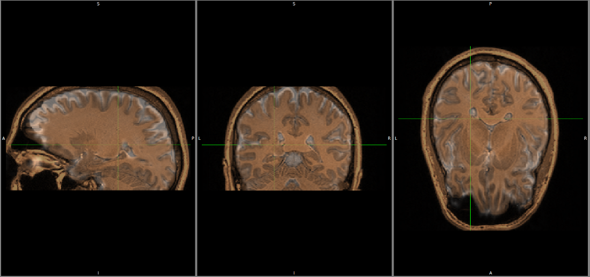
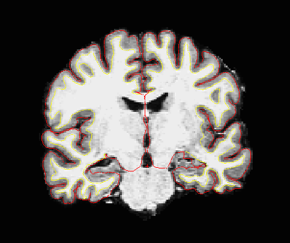
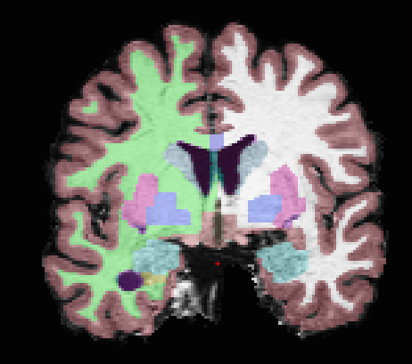
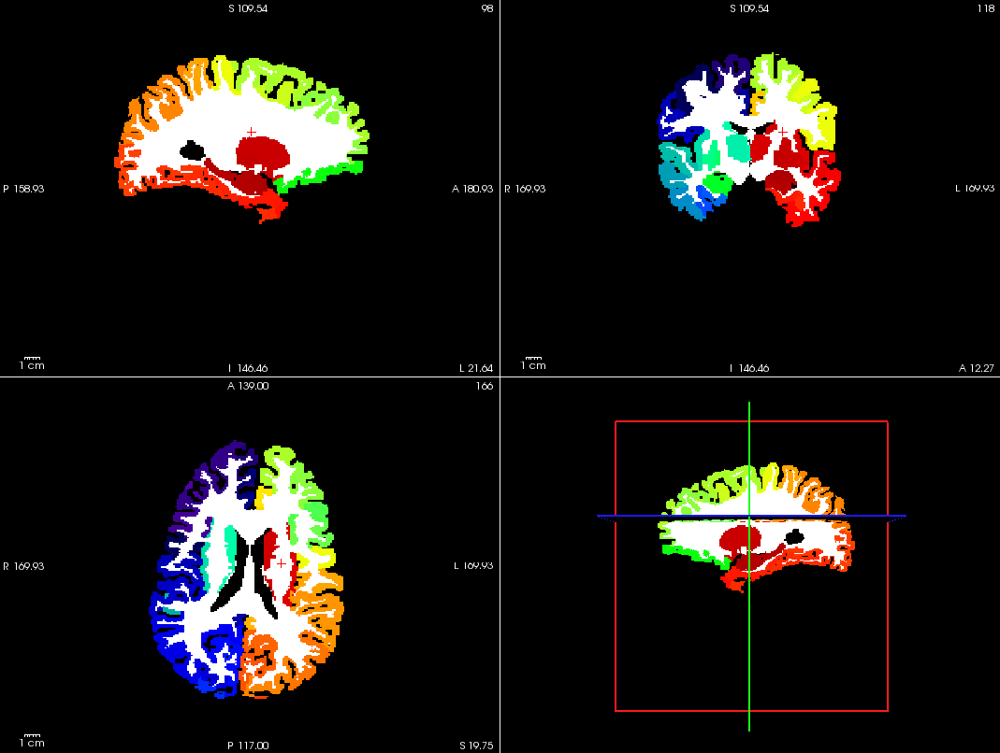
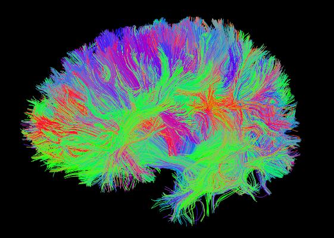
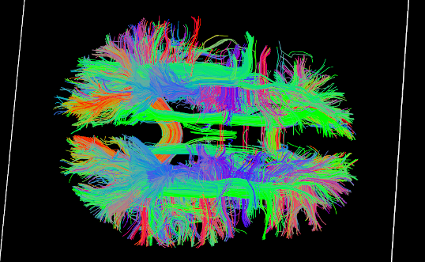
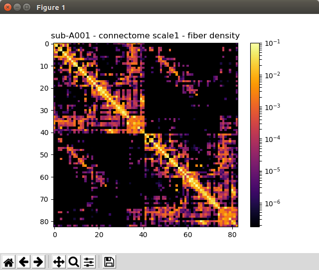

===============
Example Results
===============

Registration
------------

Registration of T1 to Diffusion space (b0). T1 in copper overlayed to the b0 image.

Segmentation
------------

Surfaces are extracted using Freesurfer.

T1 is segmented using Freesurfer.

Parcellation
------------

Cortical and subcortical parcellation are shown with Freeview.

Tractography
------------

DSI Tractography results are displayed with TrackVis.

Connection Matrix Creation
--------------------------

Generated connection matrix are displayed with Chaco.

..
	Rs-fMRI Average Time-Courses
	----------------------------
	
	Average time-courses are displayed with Matplotlib.
	
	.. image:: images/ex_rsfMRI.png
		:width: 600
