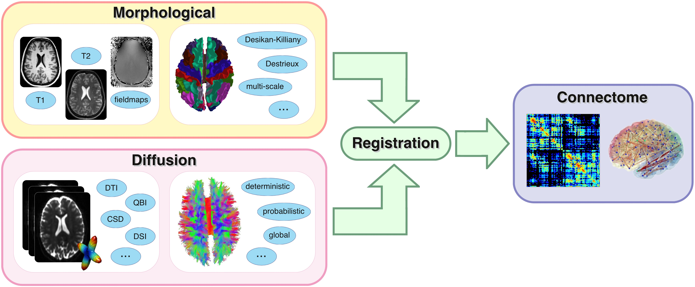

Connectome Mapper 3 (UNDER DEVELOPMENT)
=======================================================

This neuroimaging processing pipeline software is developed by the Connectomics Lab at the University Hospital of Lausanne (CHUV) for use within the `SNF Sinergia Project 170873 <http://p3.snf.ch/project-170873>`_, as well as for open-source software distribution.

..

.. image:: http://bids.neuroimaging.io/openneuro_badge.svg
  :target: https://openneuro.org
  :alt: Available in OpenNeuro!

.. image:: https://circleci.com/gh/connectomicslab/connectomemapper3/tree/master.svg?style=svg
  :target: https://circleci.com/gh/connectomicslab/connectomemapper3/tree/master
  :alt: Continuous Integration Status

.. image:: https://readthedocs.org/projects/connectome-mapper-3/badge/?version=latest
  :target: https://connectome-mapper-3.readthedocs.io/en/latest/?badge=latest
  :alt: Documentation Status

*********
About
*********

``Connectome Mapper 3``, part of the Connectome Mapping Toolkit (CMTK), implements full anatomical, diffusion and resting-state MRI processing pipelines, from raw Diffusion / T1 / T2 / BOLD data to multi-resolution connection matrices.

The ``Connectome Mapper 3`` pipelines uses a combination of tools from well-known software
packages, including `FSL <https://fsl.fmrib.ox.ac.uk/fsl/fslwiki>`_, `FreeSurfer <https://surfer.nmr.mgh.harvard.edu/>`_, `ANTs <http://stnava.github.io/ANTs/>`_, `MRtrix3 <http://www.mrtrix.org/>`_, `Dipy <https://nipy.org/dipy/>`_ and `AFNI <https://afni.nimh.nih.gov/>`_.
These pipelines were designed to provide the best software implementation for each
state of processing, and will be updated as newer and better neuroimaging
software become available.

This tool allows you to easily do the following:

- Take T1 / Diffusion / resting-state MRI data from raw to multi-resolution connection matrices.
- Implement tools from different software packages.
- Achieve optimal data processing quality by using the best tools available
- Automate and parallelize processing steps, which provides a significant
  speed-up from typical linear, manual processing.

Reproducibility and replicatibility is achieved through the distribution of a BIDSApp, a software container image which provide a frozen environment where versions of all external softwares and libraries are fixed.

.. _getting_started:

.. toctree::
   :maxdepth: 2
   :caption: Getting started

   installation

.. _user-docs:

.. toctree::
   :maxdepth: 2
   :caption: User Documentation

   cmpbackground
   bidsappmanager
   usage
   datalad

.. _about-docs:

.. toctree::
   :maxdepth: 1
   :caption: About Connectome Mapper

   LICENSE
   citing
   contributing

*********
Funding
*********

Work supported by the SNF Sinergia Grant 170873 (http://p3.snf.ch/Project-170873).

*******************
License information
*******************

This software is distributed under the open-source license Modified BSD. See :ref:`license <LICENSE>` for more details.

All trademarks referenced herein are property of their respective holders.

*******************
Aknowledgment
*******************

If your are using the Connectome Mapper 3 in your work, please acknowledge this software and its dependencies. See :ref:`Citing <citing>` for more details.

***********************
Eager to contribute?
***********************

See :ref:`Contributing to Connectome Mapper <contributing>` for more details.
