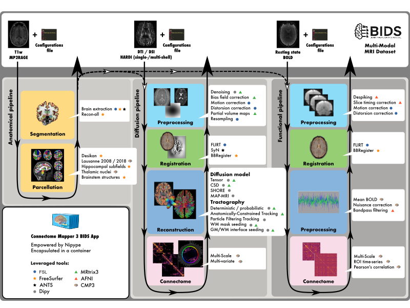

Connectome Mapper 3
===================

**Latest released version:** |release|

This neuroimaging processing pipeline software is developed by the Connectomics Lab at the University Hospital of Lausanne (CHUV) for use within the `SNF Sinergia Project 170873 <http://p3.snf.ch/project-170873>`_, as well as for open-source software distribution. Source code is hosted on `GitHub <https://github.com/connectomicslab/connectomemapper3>`_.

.. image:: https://img.shields.io/github/v/release/connectomicslab/connectomemapper3?include_prereleases
  :target: https://github.com/connectomicslab/connectomemapper3/releases
  :alt: GitHub release (latest by date including pre-releases)
.. image:: https://img.shields.io/github/release-date/connectomicslab/connectomemapper3
  :alt: GitHub Release Date
.. image:: https://zenodo.org/badge/183162514.svg
  :target: https://zenodo.org/badge/latestdoi/183162514
  :alt: Zenodo Digital Object Identifier
.. image:: https://joss.theoj.org/papers/10.21105/joss.04248/status.svg
  :target: https://doi.org/10.21105/joss.04248
  :alt: Joss Paper Digital Object Identifier
.. image:: https://img.shields.io/pypi/v/connectomemapper?color=orange
  :target: https://pypi.org/project/connectomemapper/
  :alt: PyPI
.. image:: https://img.shields.io/docker/v/sebastientourbier/connectomemapper-bidsapp?color=blue&label=docker%20version
  :target: https://hub.docker.com/r/sebastientourbier/connectomemapper-bidsapp?color=blue&label=docker%20version
  :alt: Docker Image Version (latest by date)
.. image:: https://img.shields.io/docker/pulls/sebastientourbier/connectomemapper-bidsapp?color=orange
  :target: https://hub.docker.com/r/sebastientourbier/connectomemapper-bidsapp
  :alt: Docker Pulls
.. image:: https://circleci.com/gh/connectomicslab/connectomemapper3/tree/master.svg?style=shield
  :target: https://circleci.com/gh/connectomicslab/connectomemapper3/tree/master
  :alt: Continuous Integration Status
.. image:: https://app.codacy.com/project/badge/Coverage/658266303c3046e8896769670e6988eb
  :target: https://www.codacy.com/gh/connectomicslab/connectomemapper3?utm_source=github.com&amp;utm_medium=referral&amp;utm_content=connectomicslab/connectomemapper3&amp;utm_campaign=Badge_Coverage
  :alt: Code Coverage
.. image:: https://readthedocs.org/projects/connectome-mapper-3/badge/?version=latest
  :target: https://connectome-mapper-3.readthedocs.io/en/latest/?badge=latest
  :alt: Documentation Status
.. image:: https://app.codacy.com/project/badge/Grade/658266303c3046e8896769670e6988eb
  :target: https://www.codacy.com/gh/connectomicslab/connectomemapper3?utm_source=github.com&amp;utm_medium=referral&amp;utm_content=connectomicslab/connectomemapper3&amp;utm_campaign=Badge_Grade
  :alt: Code Quality Review Status
.. image:: https://img.shields.io/badge/all_contributors-12-orange.svg?style=flat-square
  :target: contributors
  :alt: All-contributors

.. warning:: THIS SOFTWARE IS FOR RESEARCH PURPOSES ONLY AND SHALL NOT BE USED FOR ANY CLINICAL USE. THIS SOFTWARE HAS NOT BEEN REVIEWED OR APPROVED BY THE FOOD AND DRUG ADMINISTRATION OR EQUIVALENT AUTHORITY, AND IS FOR NON-CLINICAL, IRB-APPROVED RESEARCH USE ONLY. IN NO EVENT SHALL DATA OR IMAGES GENERATED THROUGH THE USE OF THE SOFTWARE BE USED IN THE PROVISION OF PATIENT CARE.

*********
About
*********

Connectome Mapper 3 is an open-source Python3 image processing pipeline software,
with a Graphical User Interface (GUI), that implements full anatomical, diffusion and
resting-state MRI processing pipelines, from raw T1 / Diffusion / BOLD / preprocessed
EEG data to multi-resolution connection matrices based on a new version of the Lausanne
parcellation atlas, aka `Lausanne2018`.

``Connectome Mapper 3`` pipelines use a combination of tools from
well-known software packages, including FSL_, FreeSurfer_, ANTs_,
MRtrix3_, Dipy_, AFNI_, MNE_, MNEcon_, and PyCartool_ empowered by
the Nipype_ dataflow library.
These pipelines are designed to provide the best software implementation
for each state of processing at the time of conception, and can be
easily updated as newer and better neuroimaging software become available.

To enhance reproducibility and replicatibility, the processing pipelines
with all dependencies are encapsulated in a Docker image container, which handles datasets
organized following the BIDS standard and is distributed as a `BIDS App`_ @
`Docker Hub <https://hub.docker.com/r/sebastientourbier/connectomemapper-bidsapp>`_.
For execution on high-performance computing cluster, a Singularity image is also made freely available @
`Sylabs Cloud <https://cloud.sylabs.io/library/_container/5fe4e971bccfe9cf45792495>`_.

To enhanced accessibility and reduce the risk of misconfiguration,
Connectome Mapper 3 comes with an interactive GUI, aka `cmpbidsappmanager`,
which supports the user in all the steps involved in the configuration of
the pipelines, the configuration and execution of the BIDS App, and
the control of the output quality. In addition, to facilitate the use
by users not familiar with Docker and Singularity containers,
Connectome Mapper 3 provides two Python commandline wrappers
(`connectomemapper3_docker` and `connectomemapper3_singularity`) that will
generate and run the appropriate command.

Since ``v3.1.0``, CMP3 provides full support to EEG.
Please check `this notebook <docs/notebooks/EEG_pipeline_tutorial.ipynb>`_ for a demonstration
using the public `VEPCON dataset <https://openneuro.org/datasets/ds003505/versions/1.1.1>`_.

.. role:: raw-html(raw)
    :format: html

.. admonition:: Carbon footprint estimation of BIDS App run 🌍🌳✨

    In support to the Organisation for Human Brain Mapping (OHBM) Sustainability and Environmental
    Action (OHBM-SEA) group, CMP3 enables you since `v3.0.3` to be more aware about the adverse impact
    of your processing on the environment!

    With the new `--track_carbon_footprint` option of the `connectomemapper3_docker` and `connectomemapper3_singularity` BIDS App python wrappers, and
    the new `"Track carbon footprint"` option of the BIDS Interface Window of `cmpbidsappmanager`, you can estimate the carbon footprint incurred by the
    execution of the BIDS App. Estimations are conducted using `codecarbon <https://codecarbon.io>`_ to estimate the amount of carbon dioxide (CO2)
    produced to execute the code by the computing resources and save the results in ``<bids_dir>/code/emissions.csv``.

    Then, to visualize, interpret and track the evolution of the emitted CO2 emissions, you can use the visualization tool of `codecarbon` aka `carbonboard` that takes as input the `.csv` created::

        $ carbonboard --filepath="<bids_dir>/code/emissions.csv" --port=xxxx

    Please check https://ohbm-environment.org to learn more about OHBM-SEA!

.. _FSL: https://fsl.fmrib.ox.ac.uk/fsl/fslwiki

.. _FreeSurfer: https://surfer.nmr.mgh.harvard.edu/fswiki/FreeSurferWiki

.. _ANTs: http://stnava.github.io/ANTs/

.. _MRtrix3: http://www.mrtrix.org/

.. _Dipy: https://nipy.org/dipy/

.. _AFNI: https://afni.nimh.nih.gov/

.. _MNE: https://mne.tools/

.. _MNEcon: https://mne.tools/mne-connectivity

.. _PyCartool: https://github.com/Functional-Brain-Mapping-Laboratory/PyCartool

.. _Nipype: https://nipype.readthedocs.io/en/latest/

.. _BIDS App: https://bids-apps.neuroimaging.io/

*******************
License information
*******************

This software is distributed under the open-source license Modified BSD.
See :ref:`license <LICENSE>` for more details.

All trademarks referenced herein are property of their respective holders.

*******************
Aknowledgment
*******************

If your are using the Connectome Mapper 3 in your work,
please acknowledge this software.
See :ref:`Citing <citing>` for more details.

Help/Questions
--------------

If you run into any problems or have any questions,
you can post to the `CMTK-users group <http://groups.google.com/group/cmtk-users>`_.
Code bugs can be reported by creating a "New Issue" on the
`source code repository <https://github.com/connectomicslab/connectomemapper3/issues>`_.

***********************
Eager to contribute?
***********************

Connectome Mapper 3 is open-source and all kind of contributions
(bug reporting, documentation, code,...) are welcome!
See :ref:`Contributing to Connectome Mapper <contributing>` for more details.

***********************
Contents
***********************

.. _getting_started:

.. toctree::
   :maxdepth: 2
   :caption: Getting started

   installation

.. _user-docs:

.. toctree::
   :maxdepth: 2
   :caption: User Documentation

   cmpbids
   usage
   bidsappmanager
   outputs

.. _api-doc:

.. toctree::
   :maxdepth: 4
   :caption: API Documentation

   api_doc

.. _user-usecases:

.. toctree::
   :maxdepth: 2
   :caption: Examples & Tutorials

   datalad
   runonhpc
   notebooks

.. _about-docs:

.. toctree::
   :maxdepth: 1
   :caption: About Connectome Mapper

   LICENSE
   changes
   citing
   contributors
   contributing
   support

*********
Funding
*********

Work supported by the SNF Sinergia Grant 170873 (http://p3.snf.ch/Project-170873).
