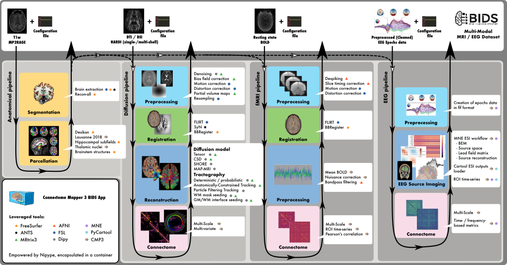

Connectome Mapper 3 (Beta release)
============================================

**Latest released version:** |release|

This neuroimaging processing pipeline software is developed by the Connectomics Lab at the University Hospital of Lausanne (CHUV) for use within the `SNF Sinergia Project 170873 <http://p3.snf.ch/project-170873>`_, as well as for open-source software distribution. Source code is hosted on GitHub at `the following link <https://github.com/connectomicslab/connectomemapper3>`_.

.. image:: https://img.shields.io/github/v/release/connectomicslab/connectomemapper3?include_prereleases
  :target: https://github.com/connectomicslab/connectomemapper3/releases
  :alt: GitHub release (latest by date including pre-releases)
.. image:: https://img.shields.io/github/release-date/connectomicslab/connectomemapper3
  :alt: GitHub Release Date
.. image:: https://zenodo.org/badge/183162514.svg
  :target: https://zenodo.org/badge/latestdoi/183162514
  :alt: Digital Object Identifier
.. image:: https://img.shields.io/docker/v/sebastientourbier/connectomemapper-bidsapp
  :target: https://hub.docker.com/r/sebastientourbier/connectomemapper-bidsapp
  :alt: Docker Image Version (latest by date)
.. image:: https://img.shields.io/docker/pulls/sebastientourbier/connectomemapper-bidsapp?label=docker
  :target: https://hub.docker.com/r/sebastientourbier/connectomemapper-bidsapp
  :alt: Docker Pulls
.. image:: https://circleci.com/gh/connectomicslab/connectomemapper3/tree/master.svg?style=svg
  :target: https://circleci.com/gh/connectomicslab/connectomemapper3/tree/master
  :alt: Continuous Integration Status
.. image:: https://readthedocs.org/projects/connectome-mapper-3/badge/?version=latest
  :target: https://connectome-mapper-3.readthedocs.io/en/latest/?badge=latest
  :alt: Documentation Status

.. warning:: THIS SOFTWARE IS FOR RESEARCH PURPOSES ONLY AND SHALL NOT BE USED FOR ANY CLINICAL USE. THIS SOFTWARE HAS NOT BEEN REVIEWED OR APPROVED BY THE FOOD AND DRUG ADMINISTRATION OR EQUIVALENT AUTHORITY, AND IS FOR NON-CLINICAL, IRB-APPROVED RESEARCH USE ONLY. IN NO EVENT SHALL DATA OR IMAGES GENERATED THROUGH THE USE OF THE SOFTWARE BE USED IN THE PROVISION OF PATIENT CARE.

*********
About
*********

``Connectome Mapper 3`` implements full anatomical, diffusion and resting-state MRI processing pipelines, from raw Diffusion / T1 / T2 / BOLD data to multi-resolution connection matrices.

The ``Connectome Mapper 3`` pipelines uses a combination of tools from well-known software packages, including FSL_, FreeSurfer_, ANTs_, MRtrix3_, Dipy_ and AFNI_. These pipelines were designed to provide the best software implementation for each state of processing, and will be updated as newer and better neuroimaging software become available.

This tool allows you to easily do the following:

  * Take T1 / Diffusion / resting-state MRI data from raw to multi-resolution connection matrices.
  * Implement tools from different software packages.
  * Achieve optimal data processing quality by using the best tools available
  * Automate and parallelize processing steps, which provides a significant speed-up from typical linear, manual processing.

Reproducibility and replicatibility is achieved through the distribution of a BIDSApp, a software container image which provide a frozen environment where versions of all external softwares and libraries are fixed.

.. _FSL: https://fsl.fmrib.ox.ac.uk/fsl/fslwiki

.. _FreeSurfer: https://surfer.nmr.mgh.harvard.edu/fswiki/FreeSurferWiki

.. _ANTs: http://stnava.github.io/ANTs/

.. _MRtrix3: http://www.mrtrix.org/

.. _Dipy: https://nipy.org/dipy/

.. _AFNI: https://afni.nimh.nih.gov/

*******************
License information
*******************

This software is distributed under the open-source license Modified BSD. See :ref:`license <LICENSE>` for more details.

All trademarks referenced herein are property of their respective holders.

*******************
Aknowledgment
*******************

If your are using the Connectome Mapper 3 in your work, please acknowledge this software and its dependencies. See :ref:`Citing <citing>` for more details.

Help/Questions
--------------

If you run into any problems or have any questions, you can post to the `CMTK-users group <http://groups.google.com/group/cmtk-users>`_. Code bugs can be reported by creating a "New Issue" on the `source code repository <https://github.com/connectomicslab/connectomemapper3/issues>`_.

***********************
Eager to contribute?
***********************

Connectome Mapper 3 is open-source and all kind of contributions (bug reporting, documentation, code,...) are welcome! See :ref:`Contributing to Connectome Mapper <contributing>` for more details.

***********************
Contents
***********************

.. _getting_started:

.. toctree::
   :maxdepth: 2
   :caption: Getting started

   installation

.. _user-docs:

.. toctree::
   :maxdepth: 2
   :caption: User Documentation

   cmpbids
   usage
   bidsappmanager
   outputs

.. _user-usecases:

.. toctree::
   :maxdepth: 2
   :caption: Examples & Tutorials

   datalad
   runonhpc

.. _about-docs:

.. toctree::
   :maxdepth: 1
   :caption: About Connectome Mapper

   LICENSE
   changes
   citing
   contributing
   support

*********
Funding
*********

Work supported by the SNF Sinergia Grant 170873 (http://p3.snf.ch/Project-170873).
