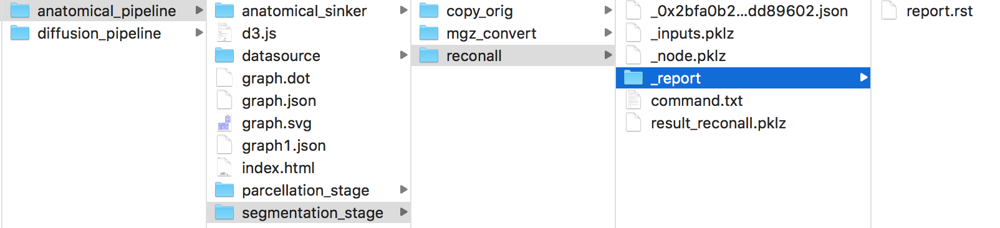
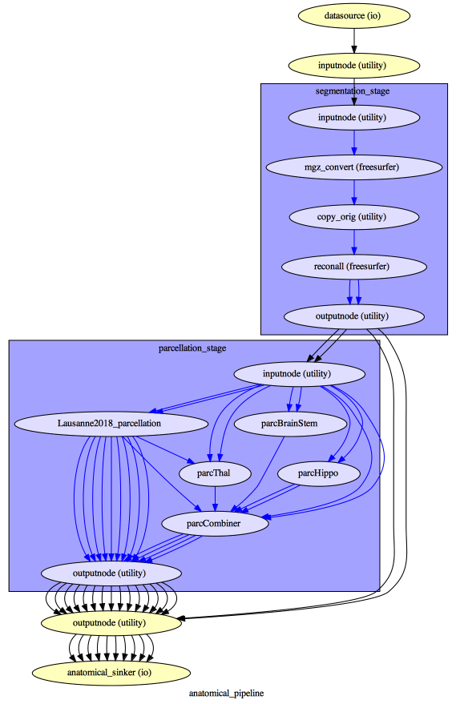
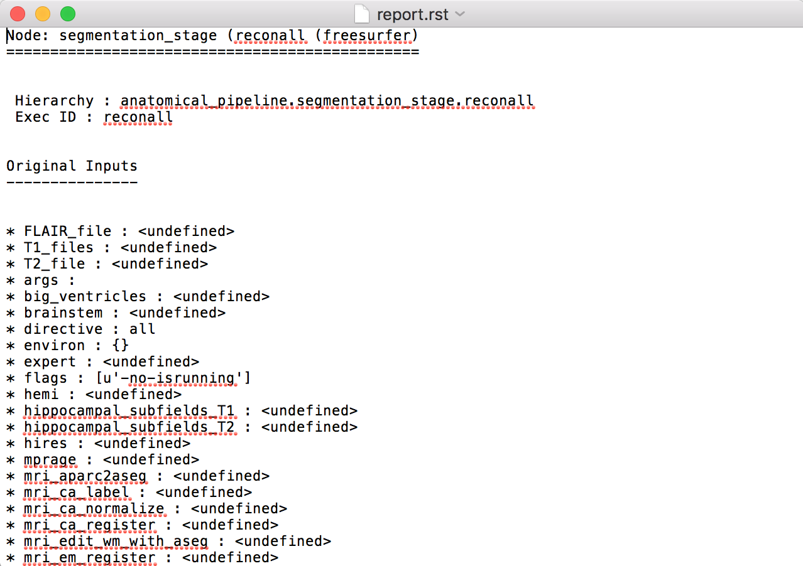

*****************************************
Outputs of Connectome Mapper 3
*****************************************

Processed, or derivative, data are outputed to ``<bids_dataset/derivatives>/``.

BIDS derivatives entities
==========================

.. tabularcolumns:: |l|p{5cm}|

+--------------------------+------------------------------------------------------------------------------------------------------------+
| **Entity**               | **Description**                                                                                            |
+==========================+============================================================================================================+
| ``sub-<label>``          | Distinguish different subjects                                                                             |
+--------------------------+------------------------------------------------------------------------------------------------------------+
| ``ses-<label>``          | Distinguish different acquisition sessions                                                                 |
+--------------------------+------------------------------------------------------------------------------------------------------------+
| ``task-<label>``         | Distinguish different experiment tasks                                                                     |
+--------------------------+------------------------------------------------------------------------------------------------------------+
| ``label-<label>``        | Describe the type of brain tissue segmented (for _probseg/dseg)                                            |
+--------------------------+------------------------------------------------------------------------------------------------------------+
| ``atlas-<label>``        | Distinguish data derived from different types of parcellation atlases                                      |
+--------------------------+------------------------------------------------------------------------------------------------------------+
| ``res-<label>``          | Distinguish data derived from the different scales of Lausanne2008 and Lausanne2018 parcellation atlases   |
+--------------------------+------------------------------------------------------------------------------------------------------------+
| ``space-DWI``            | Distinguish anatomical MRI derivatives in the target diffusion MRI space                                   |
+--------------------------+------------------------------------------------------------------------------------------------------------+
| ``model-<label>``        | Distinguish different diffusion signal models (DTI, CSD, SHORE, MAPMRI)                                    |
+--------------------------+------------------------------------------------------------------------------------------------------------+

See `Original BIDS Entities Appendix <https://bids-specification.readthedocs.io/en/v1.4.1/99-appendices/09-entities.html>`_ for more description.

.. note:: Connectome Mapper 3 introduced a new BIDS entity ``atlas-<atlas_label>``
    (where ``<atlas_label>``: ``Desikan``/ ``L2018``), that is used
    in combination with the ``res-<atlas_scale>`` (where ``<atlas_scale>``:
    ``scale1`` / ``scale2`` / ``scale3`` / ``scale4`` / ``scale5``) entity to
    distinguish data derived from different parcellation atlases and
    different scales.

Main Connectome Mapper Derivatives
====================================

Main outputs produced by Connectome Mapper 3 are written to
``cmp/sub-<subject_label>/``. In this folder, a configuration file
generated for each modality pipeline (i.e. anatomical/diffusion/fMRI/EEG)
and used for processing each participant is saved as
``sub-<subject_label>_anatomical/diffusion/fMRI/EEG_config.json``.
It summarizes pipeline workflow options and parameters used for processing.
An execution log of the full workflow is saved as `sub-<subject_label>_log.txt``.

Anatomical derivatives
------------------------

* Anatomical derivatives in the individual ``T1w`` space are placed
  in each subject's ``anat/`` subfolder, including:

    * The original T1w image:

        - ``anat/sub-<subject_label>_desc-head_T1w.nii.gz``

    * The masked T1w image with its corresponding brain mask:

        - ``anat/sub-<subject_label>_desc-brain_T1w.nii.gz``
        - ``anat/sub-<subject_label>_desc-brain_mask.nii.gz``

    * The segmentations of the white matter (WM), gray matter (GM), and Cortical Spinal Fluid (CSF) tissues:

        - ``anat/sub-<subject_label>_label-WM_dseg.nii.gz``
        - ``anat/sub-<subject_label>_label-GM_dseg.nii.gz``
        - ``anat/sub-<subject_label>_label-CSF_dseg.nii.gz``

    * The five different brain parcellations:

        - ``anat/sub-<subject_label>_atlas-<atlas_label>[_res-<scale_label>]_dseg.nii.gz``

          where:

          - ``<atlas_label>``: ``Desikan`` / ``L2018``
            is the parcellation scheme used
          - ``<scale_label>``: ``scale1``, ``scale2``, ``scale3``, ``scale4``, ``scale5``
            corresponds to the parcellation scale if applicable

        with two `.tsv` side-car files that follow the `BIDS derivatives <https://bids-specification.readthedocs.io/en/stable/05-derivatives/03-imaging.html#common-image-derived-labels>`_, one describing the parcel label/index mapping (`_dseg.tsv`), one reporting volumetry of the different parcels (`_stats.tsv`), and two files used internally by CMP3, one describing the parcel labels in `.graphml` format (`dseg.graphml`), one providing the color lookup table of the parcel labels in Freesurfer format which can used directly in `freeview` (`_FreeSurferColorLUT.txt`):

        - ``anat/sub-<subject_label>_atlas-<atlas_label>[_res-<scale_label>]_dseg.tsv``
        - ``anat/sub-<subject_label>_atlas-<atlas_label>[_res-<scale_label>]_stats.tsv``
        - ``anat/sub-<subject_label>_atlas-<atlas_label>[_res-<scale_label>]_dseg.graphml``
        - ``anat/sub-<subject_label>_atlas-<atlas_label>[_res-<scale_label>]_FreeSurferColorLUT.txt``

* Anatomical derivatives in the ``DWI`` space produced by the diffusion pipeline are placed in
  each subject's ``anat/`` subfolder, including:

    * The unmasked T1w image:

        - ``anat/sub-<subject_label>_space-DWI_desc-head_T1w.nii.gz``

    * The masked T1w image with its corresponding brain mask:

        - ``anat/sub-<subject_label>_space-DWI_desc-brain_T1w.nii.gz``
        - ``anat/sub-<subject_label>_space-DWI_desc-brain_mask.nii.gz``

    * The segmentation of WM tissue used for tractography seeding:

        - ``anat/sub-<subject_label>_space-DWI_label-WM_dseg.nii.gz``

    * The five different brain parcellation are saved as:

        - ``anat/sub-<subject_label>_space-DWI_atlas-<atlas_label>[_res-<scale_label>]_dseg.nii.gz``

          where:

          - ``<atlas_label>``: ``Desikan`` / ``L2018``
            is the parcellation scheme used
          - ``<scale_label>``: ``scale1``, ``scale2``, ``scale3``, ``scale4``, ``scale5``
            corresponds to the parcellation scale if applicable

    * The 5TT image used for Anatomically Constrained Tractorgaphy (ACT):

        - ``anat/sub-<subject_label>_space-DWI_label-5TT_probseg.nii.gz``

    * The patial volume maps for white matter (WM), gray matter (GM), and Cortical Spinal Fluid (CSF) used
      for Particale Filtering Tractography (PFT), generated from 5TT image:

        - ``anat/sub-<subject_label>_space-DWI_label-WM_probseg.nii.gz``
        - ``anat/sub-<subject_label_space-DWI>_label-GM_probseg.nii.gz``
        - ``anat/sub-<subject_label>_space-DWI_label-CSF_probseg.nii.gz``

    * The GM/WM interface used for ACT and PFT seeding:

        - ``anat/sub-<subject_label>_space-DWI_label-GMWMI_probseg.nii.gz``

Diffusion derivatives
------------------------

Diffusion derivatives in the individual ``DWI`` space are placed in
each subject's ``dwi/`` subfolder, including:

* The final preprocessed DWI image used to fit the diffusion model
  for tensor or fiber orientation distribution estimation:

    - ``dwi/sub-<subject_label>_desc-preproc_dwi.nii.gz``

* The brain mask used to mask the DWI image:

    - ``dwi/sub-<subject_label>_desc-brain_mask_resampled.nii.gz``

* The diffusion tensor (DTI) fit (if used for tractography):

    - ``dwi/sub-<subject_label>]_desc-WLS_model-DTI_diffmodel.nii.gz``

      with derived Fractional Anisotropic (FA) and Mean Diffusivity (MD) maps:

    - ``dwi/sub-<subject_label>]_model-DTI_FA.nii.gz``
    - ``dwi/sub-<subject_label>]_model-DTI_MD.nii.gz``

* The Fiber Orientation Distribution (FOD) image from
  Constrained Spherical Deconvolution (CSD) fit (if performed):

    - ``dwi/sub-<subject_label>]_model-CSD_diffmodel.nii.gz``

* The MAP-MRI fit for DSI and multi-shell DWI data (if performed):

    - ``dwi/sub-<subject_label>]_model-MAPMRI_diffmodel.nii.gz``

    with derived Generalized Fractional Anisotropic (GFA),
    Mean Squared Displacement (MSD), Return-to-Origin Probability (RTOP)
    and Return-to-Plane Probability (RTPP) maps:

    - ``dwi/sub-<subject_label>]_model-MAPMRI_GFA.nii.gz``
    - ``dwi/sub-<subject_label>]_model-MAPMRI_MSD.nii.gz``
    - ``dwi/sub-<subject_label>]_model-MAPMRI_RTOP.nii.gz``
    - ``dwi/sub-<subject_label>]_model-MAPMRI_RTPP.nii.gz``

* The SHORE fit for DSI data:

    - ``dwi/sub-<subject_label>]_model-SHORE_diffmodel.nii.gz``

    with derived Generalized Fractional Anisotropic (GFA),
    Mean Squared Displacement (MSD), Return-to-Origin Probability (RTOP) maps:

    - ``dwi/sub-<subject_label>]_model-SHORE_GFA.nii.gz``
    - ``dwi/sub-<subject_label>]_model-SHORE_MSD.nii.gz``
    - ``dwi/sub-<subject_label>]_model-SHORE_RTOP.nii.gz``

* The tractogram:

    - ``dwi/sub-<subject_label>_model-<model_label>_desc-<label>_tractogram.trk``

      where:

      - ``<model_label>`` is the diffusion model used to drive tractography
        (DTI, CSD, SHORE)
      - ``<label>`` is the type of tractography algorithm employed
        (DET for deterministic, PROB for probabilistic)

* The structural connectivity (SC) graphs:

    - ``dwi/sub-<subject_label>_atlas-<atlas_label>[_res-<scale_label>]_conndata-network_connectivity.<fmt>``

      where:

      - ``<atlas_label>``: ``Desikan`` / ``L2018``
        is the parcellation scheme used
      - ``<scale_label>``: ``scale1``, ``scale2``, ``scale3``, ``scale4``, ``scale5``
        corresponds to the parcellation scale if applicable
      - ``<fmt>``: ``mat`` / ``gpickle`` / ``tsv`` / ``graphml`` is
        the format used to store the graph

Functional derivatives
-----------------------

Functional derivatives in the 'meanBOLD' (individual) space are placed in
each subject's ``func/`` subfolder including:

* The original BOLD image:

    - ``func/sub-<subject_label>_task-rest_desc-cmp_bold.nii.gz``

* The mean BOLD image:

    - ``func/sub-<subject_label>_meanBOLD.nii.gz``

* The fully preprocessed band-pass filtered used to compute ROI time-series:

    - ``func/sub-<subject_label>_desc-bandpass_task-rest_bold.nii.gz``

* For scrubbing (if enabled):

    * The change of variance (DVARS):

        - ``func/sub-<subject_label>_desc-scrubbing_DVARS.npy``

    * The frame displacement (FD):

        - ``func/sub-<subject_label>_desc-scrubbing_FD.npy``

* Motion-related time-series:

    - ``func/sub-<subject_label>_motion.tsv``

* The ROI time-series for each parcellation scale:

    - ``func/sub-<subject_label>_atlas-<atlas_label>[_res-<scale_label>]_timeseries.npy``
    - ``func/sub-<subject_label>_atlas-<atlas_label>[_res-<scale_label>]_timeseries.mat``

      where:

        - ``<atlas_label>``: ``Desikan`` / ``L2018``
          is the parcellation scheme used
        - ``<scale_label>``: ``scale1``, ``scale2``, ``scale3``, ``scale4``, ``scale5``
          corresponds to the parcellation scale if applicable

* The functional connectivity (FC) graphs:

    - ``func/sub-<subject_label>_atlas-<atlas_label>[_res-<scale_label>]_conndata-network_connectivity.<fmt>``

      where:

      - ``<atlas_label>``: ``Desikan`` / ``L2018``
        is the parcellation scheme used
      - ``<scale_label>``: ``scale1``, ``scale2``, ``scale3``, ``scale4``, ``scale5``
        corresponds to the parcellation scale if applicable
      - ``<fmt>``: ``mat`` / ``gpickle`` / ``tsv`` / ``graphml`` is
        the format used to store the graph

EEG derivatives
-----------------------

EEG derivatives are placed in each subject's ``eeg/`` subfolder including:

* The preprocessed EEG epochs data in ``fif`` format:

    - ``eeg/sub-<subject_label>_task-<task_label>_epo.fif``

* The BEM surfaces in ``fif`` format:

    - ``eeg/sub-<subject_label>_task-<task_label>_bem.fif``

* The source space in ``fif`` format:

    - ``eeg/sub-<subject_label>_task-<task_label>_src.fif``

* The forward solution in ``fif`` format:

    - ``eeg/sub-<subject_label>_task-<task_label>_fwd.fif``

* The inverse operator in ``fif`` format:

    - ``eeg/sub-<subject_label>_task-<task_label>_inv.fif``

* The computed noise covariance in ``fif`` format:

    - ``eeg/sub-<subject_label>_task-<task_label>_noisecov.fif``

* The transform of electrode positions that might be used for ESI in ``fif`` format:

    - ``eeg/sub-<subject_label>_trans.fif``

* The ROI time-series for each parcellation atlas (and scale):

    - ``eeg/sub-<subject_label>_task-<task_label>_atlas-<atlas_label>[_res-<scale_label>]_timeseries.npy``
    - ``eeg/sub-<subject_label>_task-<task_label>_atlas-<atlas_label>[_res-<scale_label>]_timeseries.mat``

      where:

        - ``<atlas_label>``: ``Desikan`` / ``L2018``
          is the parcellation scheme used
        - ``<scale_label>``: ``scale1``, ``scale2``, ``scale3``, ``scale4``, ``scale5``
          corresponds to the parcellation scale if applicable

* The functional frequency- and time-frequency-domain based connectivity graphs:

    - ``eeg/sub-<subject_label>_task-<task_label>_atlas-<atlas_label>[_res-<scale_label>]_conndata-network_connectivity.<fmt>``

      where:

      - ``<atlas_label>``: ``Desikan`` / ``L2018``
        is the parcellation scheme used
      - ``<scale_label>``: ``scale1``, ``scale2``, ``scale3``, ``scale4``, ``scale5``
        corresponds to the parcellation scale if applicable
      - ``<fmt>``: ``mat`` / ``gpickle`` / ``tsv`` / ``graphml`` is
        the format used to store the graph

FreeSurfer Derivatives
=======================

A FreeSurfer subjects directory is created in ``<bids_dataset/derivatives>/freesurfer-7.2.0``.

::

    freesurfer-7.1.1/
        fsaverage/
            mri/
            surf/
            ...
        sub-<subject_label>/
            mri/
            surf/
            ...
        ...

The ``fsaverage`` subject distributed with the running version of FreeSurfer is copied into this directory.

.. _nipype_outputs:

Nipype Workflow Derivatives
===========================

The execution of each Nipype workflow (pipeline) dedicated to the processing of one modality (i.e. anatomical/diffusion/fMRI/EEG) involves the creation of a number of intermediate outputs which are written to ``<bids_dataset/derivatives>/nipype/sub-<subject_label>/<anatomical/diffusion/fMRI/eeg>_pipeline`` respectively:

To enhance transparency on how data is processed, outputs include a pipeline execution graph saved as ``<anatomical/diffusion/fMRI/eeg>_pipeline/graph.svg`` which summarizes all processing nodes involves in the given processing pipeline:

Execution details (data provenance) of each interface (node) of a given pipeline are reported in ``<anatomical/diffusion/fMRI/eeg>_pipeline/<stage_name>/<interface_name>/_report/report.rst``

.. note:: Connectome Mapper 3 outputs are currently being updated to conform to :abbr:`BIDS (brain imaging data structure)` v1.4.0.
