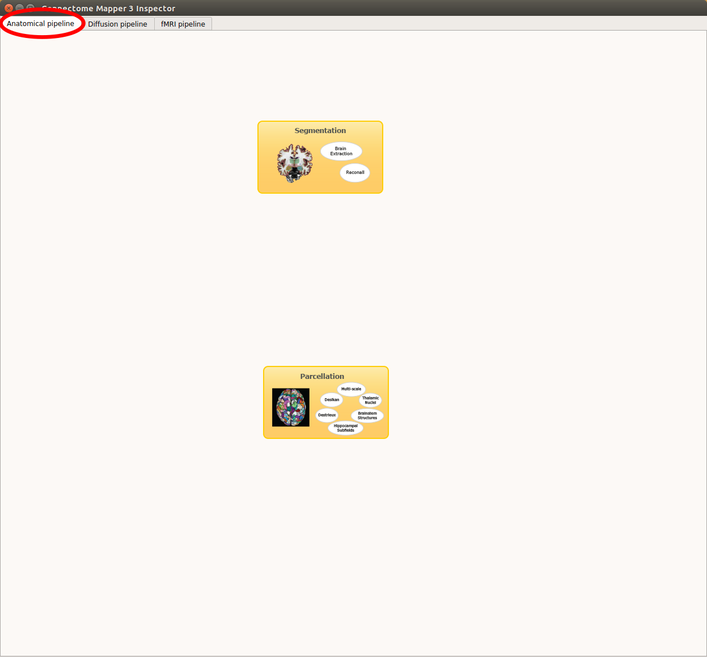
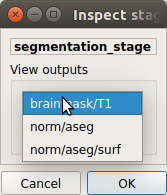
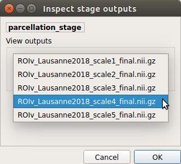
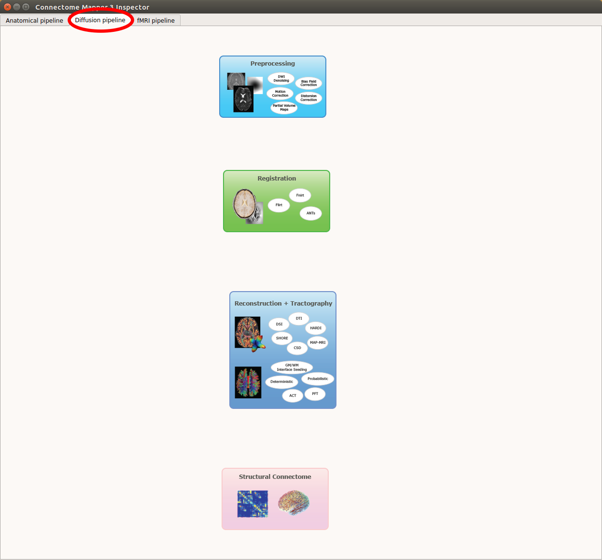
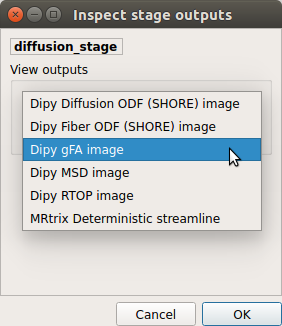
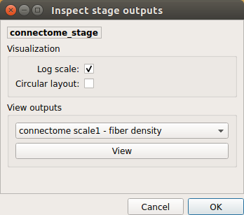

************************
Stage output inspection
************************

Stage outputs can be visually checked once the stage processing has finished via the Quality Control Window where each pipeline has a tab panel. 

A set of outputs for each pipeline stage is displayed. They can be visually checked with third-party softwares including fsleyes, freeview, mrview, trackvis and MNE visualization tools.

Anatomical pipeline
====================

Segmentation stage
---------------------

*View outputs*

	* Brain mask
	* Segmentation labels overlaid on T1 (Freesurfer)
	* Segmentation and surfaces overlaid on T1 (Freesurfer)

Parcellation stage
---------------------

*View outputs*

	* *Freesurfer, Lausanne2008, and Lausanne2018:* Parcellation(s) overlaid with brain mask
	* *Custom:* Custom atlas

Diffusion pipeline
====================

Preprocessing stage
---------------------

*View outputs*

	* Motion corrected image
	* Eddy current corrected image
	* Motion and eddy current corrected image

Registration stage
---------------------

*View outputs*

	* T1 volume linearly registered to b0 space overlayed with the b0 volume.
	* T1 volume non-linearly registered to b0 space overlayed with the b0 volume.
	* Freesurfer aparcaseg volume non-linearly registered to b0 space overlayed with the b0 volume.
	* Lausanne2008 or Lausanne 2018 parcellation volumes non-linearly registered to b0 space overlayed with the b0 volume.

Diffusion stage
---------------------

*View outputs*

	* Response function (Mrtrix CSD)
	* Fiber Orientation Distribution Functions overlayed with the FA/gFA volume
	* Fiber tracks

Connectome stage
---------------------

*View outputs*

	Extracts and displays different metrics and scalar maps from the connectivity matrices stored in gpickle format:
	* mean/median/std fiber length 
	* mean/median/std number of fibers 
	* mean/median/std FA/gFA (depending on the reconstruction model)
	* mean/median/std RTOP (if SHORE or MAP-MRI reconstruction models are used)
	* mean/median/std MSD 
	* ...

