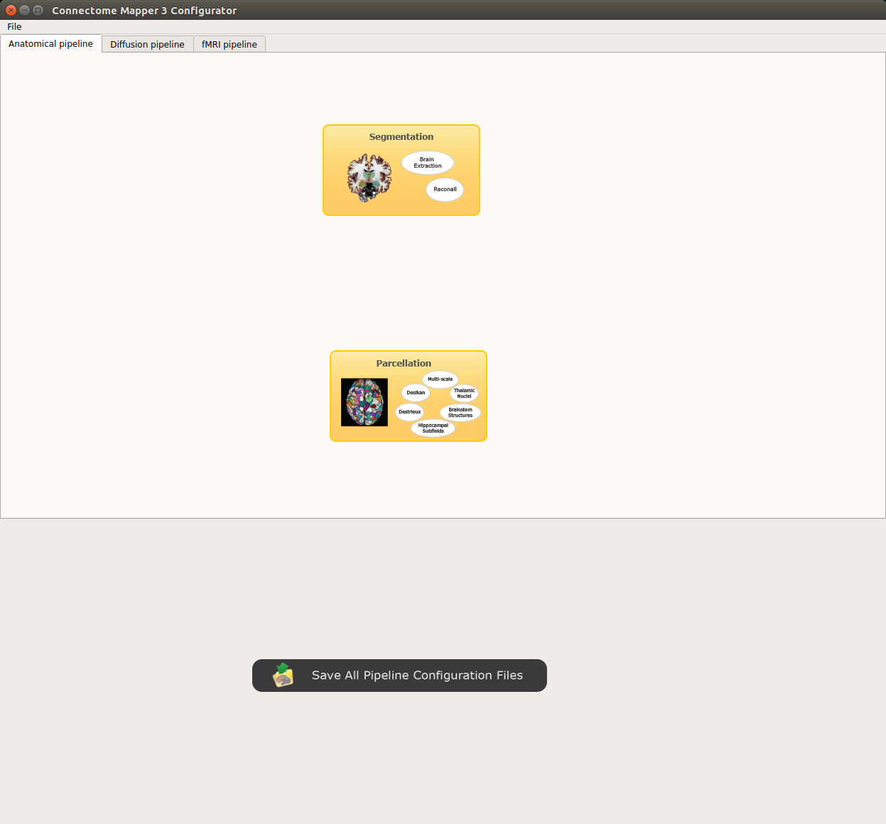

*******************
Stage configuration
*******************

Pipeline stages can be configured via the Configurator Window where each pipeline has a tab panel.

The outputs depend on the chosen parameters.

Preprocessing
-------------

Preprocessing includes denoising, bias field correction, motion and eddy current correction for diffusion data.

.. image:: images/preprocessing.png
	:align: center

*Denoising*

	Remove noise from diffusion images using (1) MRtrix3 MP-PCA method or (2) Dipy Non-Local Mean (NLM) denoising with Gaussian or Rician noise models

*Bias field correction*

	Remove intensity inhomogeneities due to the magnetic resonnace bias field using (1) MRtrix3 N4 bias field correction or (2) the bias field correction provided by FSL FAST.

*Motion correction*

	Aligns diffusion volumes to the b0 volume using FSL's MCFLIRT.

	.. note:: For hemi-sphere DSI aquisitions, warning outputs will be displayed in the console when processing empty volumes.

*Eddy current correction*

	Corrects for eddy current distortions using FSL's Eddy correct tool.

*Resampling*

	Resample morphological and diffusion data to F0 x F1 x F2 mm^3

Segmentation
------------

Performs tissue segmentation using Freesurfer or custom segmentation.

*Freesurfer*

 	.. image:: images/segmentation_fs.png
		:align: center

	* *Freesurfer args:* used to specify Freesurfer processing options
	* *Use existing freesurfer data:* Check this box if you have already Freesurfer output data available

*Custom segmentation*

 	.. image:: images/segmentation_custom.png
		:align: center

	* *White matter mask:* select the file containing your white matter binary mask

Parcellation
------------

Generates the Native Freesurfer or Lausanne2008/Lausanne2018 parcellation from Freesurfer data, or takes a custom parcellation atlas.

*Parcellation scheme*

	.. image:: images/parcellation_fs.png
		:align: center

	* *NativeFreesurfer:* Atlas composed of 83 regions from the Freesurfer aparc+aseg file

	.. image:: images/parcellation_lausanne2008.png
		:align: center

	* *Lausanne2008:* Multi-resolution atlas

	.. image:: images/parcellation_lausanne2018.png
		:align: center

	* *Lausanne2018:* Lausanne 2008 atlas extended with 7 thalamic nuclei, 12 hippocampal subfields, and 4 brainstem sub-structure per hemisphere

	.. image:: images/parcellation_custom.png
		:align: center

	* *Custom:* Custom atlas. Specify the atlas name, the number of regions, the nifti file and a corresponding graphml file. The Graphml file must contain at least a "dn_correspondence_id" field for each node. This field should contain the region's label in the nifti file.

Registration
------------

*Registration mode*

	.. image:: images/registration_flirt.png
		:align: center

	* Linear (FSL): perform linear registration from T1 to diffusion b0 using FSL's flirt.

	.. image:: images/registration_fs.png
		:align: center

	* BBregister (FS): perform linear registration using Freesurfer BBregister tool.

	.. image:: images/registration_ants.png
		:align: center

	* Non-linear (ANTS): perform symmetric diffeomorphic SyN registration from T1 to b0

Diffusion reconstruction and tractography
------------------------------------------

Performs diffusion reconstruction and local deterministic or probabilistic tractography based on several tools. ROI dilation is required to map brain connections when the tracking only operates in the white matter.

	.. figure:: images/diffusion_config_window.png
		:align: center

		Diffusion stage configuration window

*Reconstruction tool*

	**Dipy**: performs SHORE, tensor, CSD and MAP-MRI reconstruction.

		* SHORE:

			.. image:: images/diffusion_dipy_shore.png
				:align: center

			SHORE performed only on DSI data

		* Tensor:

			.. image:: images/diffusion_dipy_tensor.png
				:align: center

			Tensor performed only on DTI data

		* CSD:

			.. image:: images/diffusion_dipy_csd.png
				:align: center

			CSD performed on DTI and multi-shell data

		* MAP_MRI:

			.. image:: images/diffusion_dipy_mapmri.png
				:align: center

			MAP-MRI performed only on multi-shell data

	**MRtrix**: performs CSD reconstruction.

		* CSD:

			.. image:: images/diffusion_mrtrix_csd.png
				:align: center

			CSD performed on DTI and multi-shell data

*Tractography tool*

	**Dipy**: performs deterministic and probabilistic fiber tracking as well as particle filtering tractography.

		* Deterministic tractography:

			.. image:: images/diffusion_dipy_deterministic.png
				:align: center

			Deterministic tractography (SD_STREAM) performed on single tensor or CSD reconstruction

		* Probabilistic tractography:

			.. image:: images/diffusion_dipy_probabilistic.png
				:align: center

			Probabilistic tractography (iFOD2) performed on SHORE or CSD reconstruction

		* Probabilistic particle filtering tractography (PFT):

			.. image:: images/diffusion_dipy_probabilistic_PFT.png
				:align: center

			Probabilistic PFT tracking performed on SHORE or CSD reconstruction. Seeding from the gray matter / white matter interface is possible.

	**MRtrix**: performs deterministic and probabilistic fiber tracking as well as anatomically-constrained tractography. ROI dilation is required to map brain connections when the tracking only operates in the white matter.

		* Deterministic tractography:

			.. image:: images/diffusion_mrtrix_deterministic.png
				:align: center

			Deterministic tractography (SD_STREAM) performed on single tensor or CSD reconstruction

		* Deterministic anatomically-constrained tractography (ACT):

			.. image:: images/diffusion_mrtrix_deterministic_ACT.png
				:align: center

			Deterministic ACT tracking performed on single tensor or CSD reconstruction. Seeding from the gray matter / white matter interface is possible. Backtrack option is not available in deterministic tracking.

		* Probabilistic tractography:

			.. image:: images/diffusion_mrtrix_probabilistic.png
				:align: center

			Probabilistic tractography (iFOD2) performed on SHORE or CSD reconstruction

		* Probabilistic anatomically-constrained tractography (ACT):

			.. image:: images/diffusion_mrtrix_probabilistic_ACT.png
				:align: center

			Probabilistic ACT tracking performed on SHORE or CSD reconstruction. Seeding from the gray matter / white matter interface is possible.

Connectome
----------

Computes fiber length connectivity matrices. If DTI data is processed, FA additional map is computed. In case of DSI, additional maps include GFA and RTOP. In case of MAP-MRI, additional maps are RTPP, RTOP, ...

.. image:: images/connectome.png
	:align: center

*Output types*

	Select in which formats the connectivity matrices should be saved.

Nipype
-------

The Connectome Mapper processing relies on nipype. For each stage, a processing folder is created in $Base_directory/derivatives/nipype/sub-<participant_label>/<pipeline_name>/<stage_name>.

All intermediate steps for the processing are saved in the corresponding stage folders.

