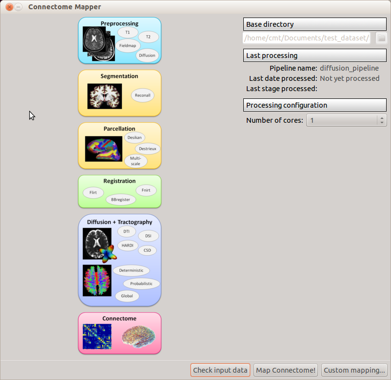

***************************
Configure processing stages
***************************

Main window
-----------

*Stages*
	Contains the pipeline stages : Preprocessing, Segmentation, Parcellation, Registration, Diffustion and Tractography as well as Connectome creation. Clicking on a processing stage button opens a dialog window to configure the stage's parameters.
	
*Pipeline info*
	Base directory for the project.
	
	Last processing info.
	
	Number of cores: can be used for multithreading
	
Preprocessing
-------------

.. image:: images/preprocessing.png

*Motion correction*
	Aligns diffusion volumes to the b0 volume using FSL's MCFLIRT.

*Eddy current correction*
	Corrects for eddy current distortions using FSL's Eddy correct tool.