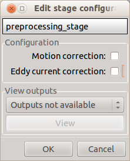

*******************
Stage configuration
*******************

Each stage has a configuration and a "View outputs" panel. The configuration panel allows to set the stage parameters. The "View outputs" panel displays a set of outputs that can be visually checked once the stage processing has finished. The outputs depend on the chosen parameters.
	
Preprocessing
-------------

Preprocessing includes motion and eddy current correction for diffusion data.

*Motion correction*

	Aligns diffusion volumes to the b0 volume using FSL's MCFLIRT.
	
	.. note:: For hemi-sphere DSI aquisitions, warning outputs will be displayed in the console when processing empty volumes.

*Eddy current correction*

	Corrects for eddy current distortions using FSL's Eddy correct tool.
	
*View outputs*

	* Motion corrected image
	* Eddy current corrected image
	* Motion and eddy current corrected image
	
Segmentation
------------

Performs tissue segmentation using Freesurfer or custom segmentation.  

*Freesurfer*

 	.. image:: images/segmentation_fs.png
		:align: center

	* *Freesurfer args:* used to specify Freesurfer processing options
	* *Use existing freesurfer data:* Check this box if you have already Freesurfer output data available
	
*Custom segmentation*

 	.. image:: images/segmentation_custom.png
		:align: center

	* *White matter mask:* select the file containing your white matter binary mask
	
*View outputs*

	* Brain mask
	* Segmentation labels overlaid on T1 (Freesurfer)
	* Segmentation and surfaces overlaid on T1 (Freesurfer)
	
Parcellation
------------

Generates the Native Freesurfer or Lausanne2008 parcellation from Freesurfer data, or takes a custom parcellation atlas.
	
*Parcellation scheme*

	.. image:: images/parcellation_fs.png
		:align: center

	* *NativeFreesurfer:* Atlas composed of 83 regions from the Freesurfer aparc+aseg file
	
	.. image:: images/parcellation_lausanne2008.png
		:align: center
	
	* *Lausanne2008:* Multi-resolution atlas
	
	.. image:: images/parcellation_custom.png
		:align: center
	
	* *Custom:* Custom atlas. Specify the atlas name, the number of regions, the nifti file and a corresponding graphml file. The Graphml file must contain at least a "dn_correspondence_id" field for each node. This field should contain the region's label in the nifti file.
	
*View outputs*

	* *Freesurfer and Lausanne2008:* Parcellation(s) overlaid with brain mask
	* *Custom:* Custom atlas
	
Registration
------------

*Registration mode*

	.. image:: images/registration_flirt.png
		:align: center

	* Linear (FSL): perform linear registration from T1 to diffusion b0 using FSL's flirt.
	
	.. image:: images/registration_fs.png
		:align: center
	
	* BBregister (FS): perform linear registration using Freesurfer BBregister tool.
	
	.. image:: images/registration_fnirt.png
		:align: center
		
	* Non-linear (FSL): perform non-linear registration from T1 to b0 (only available if T2 scans are found).
	
*View outputs*

	* T1 volume registered to b0 space overlayed with the b0 volume.
	
Diffusion and tractography
--------------------------

Performs deterministic, probabilistic or global tractography based on several tools.

.. note:: There is currently an issue with window resizing when changing processing tools. Close the window and reopen it when you change the processing tool.
	
*Resampling*

	Resample diffusion data to F0 x F1 x F2 mm^3

*Processing tool*

	.. image:: images/diffusion_dtk.png
		:align: center

	**DTK**: performs tensor reconstruction and deterministic fiber tracking. The algorithm ensures that fibers terminate in the grey matter (no ROI dilation required).
		
	**MRtrix**: performs tensor and CSD reconstruction as well as deterministic and probabilistic fiber tracking. ROI dilation is required to map brain connections as the tracking only operates in the white matter.
		
		* Deterministic:
		
			.. image:: images/diffusion_mrtrix_deterministic.png
				:align: center
				
			Deterministic tracking performed on single tensor or CSD reconstruction
		
		* Probabilistic:
		
			.. image:: images/diffusion_mrtrix_probabilistic.png
				:align: center
		
			Probabilistic tracking is currently only available from CSD reconstruction. Seed regions are defined as the intersection between dilated ROIs and the white matter mask.
			
	**Camino**: performs multi model reconstruction and also deterministic and probabilistic fiber tracking. ROI dilation required as for MRtrix processing.
	
		* Deterministic:
		
			.. image:: images/diffusion_camino_deterministic.png
				:align: center
				
			Deterministic tracking can be performed on single or multi-tensor reconstructions. Reconstructions using Ball-stick or Restore algorithms are also available.
		
		* Probabilistic:
		
			.. image:: images/diffusion_camino_probabilistic.png
				:align: center
		
			For now, probabilistic tracking with Camino only includes the "pico" tracking algorithm. Make sure that the trace units match your b-values in the gradient table.
		
	**FSL**: performs probabilistic tracking
	
		.. image:: images/diffusion_fsl.png
			:align: center
				
	**Gibbs**: performs global tractography based on FSL tensor or MRtrix CSD reconstruction
	
		.. image:: images/diffusion_gibbs.png
			:align: center	
		
	
*View outputs*

	* Fiber tracks (when deterministic of global tractography is performed)
	* Response function (Mrtrix CSD)
	
Connectome
----------

Computes fiber length connectivity matrices. If DTI or HARDI data is processed, FA additional map is computed. In case of DSI, additional maps include GFA, Skewness, Kurtosis and P0.

.. image:: images/connectome.png
	:align: center

*Output types*

	Select in which formats the connectivity matrices should be saved.
	
*View outputs*

	Connectivity matrices in gpickle format: extracts and displays mean fiber length matrices

******
Nipype 
******

The Connectome Mapper processing relies on nipype. For each stage, a processing folder is created in $Base_directory/NIPYPE/diffusion_pipeline/<stage_name>.

All intermediate steps for the processing are saved in the corresponding stage folders.
	
